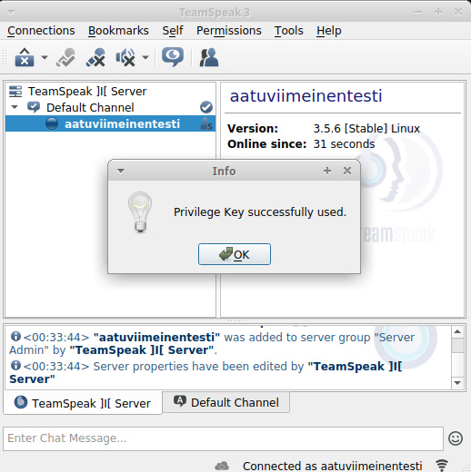

 # Esitys
Aatu Alanen

Ohjelma tekee valmiin teamspeak VOIP palvelun.

Moduulin tarkoituksena on luoda teamspeak käyttäjä johon asennetaan teamspeak3 server ja hyväksytään automaattisesti ehdot ja käynnistetään palvelu.
Moduuli perustuu oletukseen, että käyttöliittymänä on xubuntu-18.04.

 # init.sls
 
    
    teamspeakuser:
      user.present:
        - name: teamspeak
    extract:
      archive.extracted:
        - name: /home/teamspeak/
        - source: https://files.teamspeak-services.com/releases/server/3.13.2/teamspeak3-server_linux_amd64-3.13.2.tar.bz2
        - source_hash: ffb6c8cc222228eaaed79930ebd39fbf2f8a6d557d1a67d7eafc5e7e8c4931d1
        - user: teamspeak
        - group: teamspeak
    /home/teamspeak/teamspeak3-server_linux_amd64/.ts3server_license_accepted:
      file.managed:
        - source: salt://teamspeak/.ts3server_license_accepted
        - user: teamspeak
        - group: teamspeak
    /lib/systemd/system/teamspeak.service:
      file.managed:
        - source: salt://teamspeak/teamspeak.service
    teamspeakservice:
      service.running:
        - name: teamspeak
        - enable: True
    test.sleep:
      module.run:
       - length: 3
    checkstatusgettoken:
      cmd.run:
        - name: 'systemctl status teamspeak'
            
            
 # teamspeak.service
 
    [Unit]
    Description=TeamSpeak 3 Server
    After=network.target
    [Service]
    WorkingDirectory=/home/teamspeak/teamspeak3-server_linux_amd64/
    User=teamspeak
    Group=teamspeak
    Type=forking
    ExecStart=/home/teamspeak/teamspeak3-server_linux_amd64/ts3server_startscript.sh start inifile=ts3server.ini
    ExecStop=/home/teamspeak/teamspeak3-server_linux_amd64/ts3server_startscript.sh stop
    PIDFile=/home/teamspeak/teamspeak3-server_linux_amd64/ts3server.pid
    RestartSec=15
    Restart=always
    [Install]
    WantedBy=multi-user.target
            

 # state.apply
 
    sudo salt '*' state.apply teamspeak

    noop:
    ----------
      ID: teamspeakuser
    Function: user.present
    Name: teamspeak
    Result: True
    Comment: New user teamspeak created
    Started: 00:29:00.170868
    Duration: 41.366 ms
    Changes:   
          ----------
          fullname:
          gid:
              1003
          groups:
              - teamspeak
          home:
              /home/teamspeak
          homephone:
          name:
              teamspeak
          passwd:
              x
          roomnumber:
          shell:
              /bin/sh
          uid:
              1003
          workphone:
    ----------
      ID: extract
    Function: archive.extracted
    Name: /home/teamspeak/
    Result: True
    Comment: https://files.teamspeak-services.com/releases/server/3.13.2/teamspeak3-server_linux_amd64-3.13.2.tar.bz2 extracted to /home/teamspeak/, due to absence of one or more files/dirs
    Started: 00:29:00.213114
    Duration: 1810.336 ms
    Changes:   
          ----------
          extracted_files:
              - teamspeak3-server_linux_amd64
              - teamspeak3-server_linux_amd64/LICENSE
              - teamspeak3-server_linux_amd64/tsdns
              - teamspeak3-server_linux_amd64/tsdns/tsdnsserver
              - teamspeak3-server_linux_amd64/tsdns/README
              - teamspeak3-server_linux_amd64/tsdns/USAGE
              - teamspeak3-server_linux_amd64/tsdns/tsdns_settings.ini.sample
              - teamspeak3-server_linux_amd64/sql
              - teamspeak3-server_linux_amd64/sql/group_member_delete.sql
              - teamspeak3-server_linux_amd64/sql/update_sqlite_32.sql
              - teamspeak3-server_linux_amd64/sql/update_28.sql
              - teamspeak3-server_linux_amd64/sql/perm_insert_bulk.sql
              - teamspeak3-server_linux_amd64/sql/channel_delete.sql
              - teamspeak3-server_linux_amd64/sql/update_21.sql
              - teamspeak3-server_linux_amd64/sql/api_key_delete.sql
              - teamspeak3-server_linux_amd64/sql/complain_delete_prune.sql
              - teamspeak3-server_linux_amd64/sql/groups_get_by_serverid_type.sql
              - teamspeak3-server_linux_amd64/sql/update_16.sql
              - teamspeak3-server_linux_amd64/sql/permission_load_channel_group_total.sql
              - teamspeak3-server_linux_amd64/sql/update_15.sql
              - teamspeak3-server_linux_amd64/sql/client_clear_traffic_stats.sql
              - teamspeak3-server_linux_amd64/sql/ban_list.sql
              - teamspeak3-server_linux_amd64/sql/client_get_by_id.sql
              - teamspeak3-server_linux_amd64/sql/update_mariadb_32.sql
              - teamspeak3-server_linux_amd64/sql/revocations_delete.sql
              - teamspeak3-server_linux_amd64/sql/server_update_machine_id.sql
              - teamspeak3-server_linux_amd64/sql/perm_update_get_groups.sql
              - teamspeak3-server_linux_amd64/sql/update_34.sql
              - teamspeak3-server_linux_amd64/sql/update_27.sql
              - teamspeak3-server_linux_amd64/sql/group_member_get.sql
              - teamspeak3-server_linux_amd64/sql/message_update_flag.sql
              - teamspeak3-server_linux_amd64/sql/client_update_stats.sql
              - teamspeak3-server_linux_amd64/sql/groups_get.sql
              - teamspeak3-server_linux_amd64/sql/channel_insert.sql
              - teamspeak3-server_linux_amd64/sql/client_count_queries.sql
              - teamspeak3-server_linux_amd64/sql/group_member_delete_by_groupid.sql
              - teamspeak3-server_linux_amd64/sql/update_24.sql
              - teamspeak3-server_linux_amd64/sql/binding_delete.sql
              - teamspeak3-server_linux_amd64/sql/channel_insert_bulk.sql
              - teamspeak3-server_linux_amd64/sql/update_23.sql
              - teamspeak3-server_linux_amd64/sql/info_get_by_ident.sql
              - teamspeak3-server_linux_amd64/sql/client_delete_prune.sql
              - teamspeak3-server_linux_amd64/sql/client_get_queries_per_server_limit.sql
              - teamspeak3-server_linux_amd64/sql/properties_delete_by_string_id.sql
              - teamspeak3-server_linux_amd64/sql/temporary_password_list.sql
              - teamspeak3-server_linux_amd64/sql/channel_insert_bulk_fixup.sql
              - teamspeak3-server_linux_amd64/sql/perm_group_copy.sql
              - teamspeak3-server_linux_amd64/sql/custom_insert.sql
              - teamspeak3-server_linux_amd64/sql/complain_get_by_serverid.sql
              - teamspeak3-server_linux_amd64/sql/group_insert.sql
              - teamspeak3-server_linux_amd64/sql/client_insert.sql
              - teamspeak3-server_linux_amd64/sql/perm_copy_default_permissions.sql
              - teamspeak3-server_linux_amd64/sql/properties_insert_by_string_id.sql
              - teamspeak3-server_linux_amd64/sql/integration_action_list.sql
              - teamspeak3-server_linux_amd64/sql/server_list_detailed.sql
              - teamspeak3-server_linux_amd64/sql/token_list.sql
              - teamspeak3-server_linux_amd64/sql/update_sqlite_33.sql
              - teamspeak3-server_linux_amd64/sql/temporary_password_delete.sql
              - teamspeak3-server_linux_amd64/sql/update_20.sql
              - teamspeak3-server_linux_amd64/sql/complain_insert.sql
              - teamspeak3-server_linux_amd64/sql/update_31.sql
              - teamspeak3-server_linux_amd64/sql/client_get_by_serverid_bulk.sql
              - teamspeak3-server_linux_amd64/sql/update_26.sql
              - teamspeak3-server_linux_amd64/sql/channel_update_parentid.sql
              - teamspeak3-server_linux_amd64/sql/api_key_insert.sql
              - teamspeak3-server_linux_amd64/sql/client_remove_query_login.sql
              - teamspeak3-server_linux_amd64/sql/create_postgresql
              - teamspeak3-server_linux_amd64/sql/create_postgresql/drop_tables.sql
              - teamspeak3-server_linux_amd64/sql/create_postgresql/create_tables.sql
              - teamspeak3-server_linux_amd64/sql/create_postgresql/channel_insert_bulk_fixup.sql
              - teamspeak3-server_linux_amd64/sql/create_postgresql/client_get_by_serverid_bulk.sql
              - teamspeak3-server_linux_amd64/sql/create_postgresql/after_defaults.sql
              - teamspeak3-server_linux_amd64/sql/client_get_by_name_or_uid.sql
              - teamspeak3-server_linux_amd64/sql/update_19.sql
              - teamspeak3-server_linux_amd64/sql/complain_delete_all.sql
              - teamspeak3-server_linux_amd64/sql/token_delete_by_key.sql
              - teamspeak3-server_linux_amd64/sql/group_id_get_by_name.sql
              - teamspeak3-server_linux_amd64/sql/server_list_by_machine_id_detailed.sql
              - teamspeak3-server_linux_amd64/sql/integration_action_insert.sql
              - teamspeak3-server_linux_amd64/sql/group_rename.sql
              - teamspeak3-server_linux_amd64/sql/integration_list.sql
              - teamspeak3-server_linux_amd64/sql/update_mariadb_27.sql
              - teamspeak3-server_linux_amd64/sql/channel_server_list_properties_bulk.sql
              - teamspeak3-server_linux_amd64/sql/integration_insert.sql
              - teamspeak3-server_linux_amd64/sql/update_mariadb_29.sql
              - teamspeak3-server_linux_amd64/sql/ban_delete.sql
              - teamspeak3-server_linux_amd64/sql/message_insert.sql
              - teamspeak3-server_linux_amd64/sql/group_members_get_by_groupid.sql
              - teamspeak3-server_linux_amd64/sql/properties_insert_by_id.sql
              - teamspeak3-server_linux_amd64/sql/integration_action_delete.sql
              - teamspeak3-server_linux_amd64/sql/perm_delete_by_groupid.sql
              - teamspeak3-server_linux_amd64/sql/update_permissions_12.sql
              - teamspeak3-server_linux_amd64/sql/update_mariadb_26.sql
              - teamspeak3-server_linux_amd64/sql/defaults.sql
              - teamspeak3-server_linux_amd64/sql/update_22.sql
              - teamspeak3-server_linux_amd64/sql/permission_load_server_and_channel_group_total.sql
              - teamspeak3-server_linux_amd64/sql/message_delete.sql
              - teamspeak3-server_linux_amd64/sql/perm_delete_by_serverid.sql
              - teamspeak3-server_linux_amd64/sql/perm_delete_by_permid.sql
              - teamspeak3-server_linux_amd64/sql/perm_group_perm_copy.sql
              - teamspeak3-server_linux_amd64/sql/update_13.sql
              - teamspeak3-server_linux_amd64/sql/api_key_list.sql
              - teamspeak3-server_linux_amd64/sql/client_get.sql
              - teamspeak3-server_linux_amd64/sql/custom_get_by_ident.sql
              - teamspeak3-server_linux_amd64/sql/group_member_detail_get_by_groupid.sql
              - teamspeak3-server_linux_amd64/sql/client_delete.sql
              - teamspeak3-server_linux_amd64/sql/perm_rename.sql
              - teamspeak3-server_linux_amd64/sql/group_members_get_by_id.sql
              - teamspeak3-server_linux_amd64/sql/server_snapshot_delete.sql
              - teamspeak3-server_linux_amd64/sql/group_member_insert.sql
              - teamspeak3-server_linux_amd64/sql/groups_get_by_serverid.sql
              - teamspeak3-server_linux_amd64/sql/custom_get_by_id.sql
              - teamspeak3-server_linux_amd64/sql/ban_insert.sql
              - teamspeak3-server_linux_amd64/sql/channel_insert_bulk_mapping.sql
              - teamspeak3-server_linux_amd64/sql/server_delete_get_qa_clients.sql
              - teamspeak3-server_linux_amd64/sql/permission_load_other.sql
              - teamspeak3-server_linux_amd64/sql/message_get_unread_by_clientid.sql
              - teamspeak3-server_linux_amd64/sql/server_update_port.sql
              - teamspeak3-server_linux_amd64/sql/bindings_insert.sql
              - teamspeak3-server_linux_amd64/sql/update_25.sql
              - teamspeak3-server_linux_amd64/sql/channel_properties_bulk_insert.sql
              - teamspeak3-server_linux_amd64/sql/custom_delete.sql
              - teamspeak3-server_linux_amd64/sql/client_get_by_uid.sql
              - teamspeak3-server_linux_amd64/sql/info_insert.sql
              - teamspeak3-server_linux_amd64/sql/temporary_password_insert.sql
              - teamspeak3-server_linux_amd64/sql/server_update_autostart.sql
              - teamspeak3-server_linux_amd64/sql/revocations_getlist.sql
              - teamspeak3-server_linux_amd64/sql/update_mariadb_28.sql
              - teamspeak3-server_linux_amd64/sql/server_get_byport.sql
              - teamspeak3-server_linux_amd64/sql/perm_group_get_mapping.sql
              - teamspeak3-server_linux_amd64/sql/update_sqlite_29.sql
              - teamspeak3-server_linux_amd64/sql/client_get_by_serverid_limit.sql
              - teamspeak3-server_linux_amd64/sql/group_delete.sql
              - teamspeak3-server_linux_amd64/sql/update_12.sql
              - teamspeak3-server_linux_amd64/sql/updates_and_fixes
              - teamspeak3-server_linux_amd64/sql/updates_and_fixes/mariadb_fix_latin_utf8.sql
              - teamspeak3-server_linux_amd64/sql/updates_and_fixes/convert_mysql_to_mariadb.sql
              - teamspeak3-server_linux_amd64/sql/create_mariadb
              - teamspeak3-server_linux_amd64/sql/create_mariadb/drop_tables.sql
              - teamspeak3-server_linux_amd64/sql/create_mariadb/create_tables.sql
              - teamspeak3-server_linux_amd64/sql/channel_server_list.sql
              - teamspeak3-server_linux_amd64/sql/permission_load_server_group_total.sql
              - teamspeak3-server_linux_amd64/sql/perm_insert.sql
              - teamspeak3-server_linux_amd64/sql/message_get_by_clientid.sql
              - teamspeak3-server_linux_amd64/sql/properties_list_by_id.sql
              - teamspeak3-server_linux_amd64/sql/perm_get_by_serverid.sql
              - teamspeak3-server_linux_amd64/sql/client_get_queries_limit.sql
              - teamspeak3-server_linux_amd64/sql/clientid_get_by_name_pw_serverid.sql
              - teamspeak3-server_linux_amd64/sql/update_29.sql
              - teamspeak3-server_linux_amd64/sql/client_update_login_info.sql
              - teamspeak3-server_linux_amd64/sql/server_delete.sql
              - teamspeak3-server_linux_amd64/sql/bindings_list.sql
              - teamspeak3-server_linux_amd64/sql/custom_update.sql
              - teamspeak3-server_linux_amd64/sql/client_insert_bulk.sql
              - teamspeak3-server_linux_amd64/sql/update_14.sql
              - teamspeak3-server_linux_amd64/sql/client_insert_query.sql
              - teamspeak3-server_linux_amd64/sql/update_sqlite_28.sql
              - teamspeak3-server_linux_amd64/sql/client_insert_bulk_mapping.sql
              - teamspeak3-server_linux_amd64/sql/server_update_traffic_stats.sql
              - teamspeak3-server_linux_amd64/sql/channel_delete_bulk.sql
              - teamspeak3-server_linux_amd64/sql/update_30.sql
              - teamspeak3-server_linux_amd64/sql/update_mariadb_33.sql
              - teamspeak3-server_linux_amd64/sql/complain_delete.sql
              - teamspeak3-server_linux_amd64/sql/client_get_by_serverid.sql
              - teamspeak3-server_linux_amd64/sql/server_snapshot_delete_failed.sql
              - teamspeak3-server_linux_amd64/sql/update_postgresql_33.sql
              - teamspeak3-server_linux_amd64/sql/perm_get_by_id.sql
              - teamspeak3-server_linux_amd64/sql/update_33.sql
              - teamspeak3-server_linux_amd64/sql/create_sqlite
              - teamspeak3-server_linux_amd64/sql/create_sqlite/drop_tables.sql
              - teamspeak3-server_linux_amd64/sql/create_sqlite/create_tables.sql
              - teamspeak3-server_linux_amd64/sql/revocations_insert_bulk.sql
              - teamspeak3-server_linux_amd64/sql/properties_list_by_string_id.sql
              - teamspeak3-server_linux_amd64/sql/message_list_by_clientid.sql
              - teamspeak3-server_linux_amd64/sql/token_insert.sql
              - teamspeak3-server_linux_amd64/sql/update_32.sql
              - teamspeak3-server_linux_amd64/sql/client_update_traffic_stats.sql
              - teamspeak3-server_linux_amd64/sql/group_insert_bulk_snapshot_get_mapping.sql
              - teamspeak3-server_linux_amd64/sql/client_properties_bulk_insert.sql
              - teamspeak3-server_linux_amd64/sql/group_member_insert_bulk.sql
              - teamspeak3-server_linux_amd64/sql/server_get_byid.sql
              - teamspeak3-server_linux_amd64/sql/properties_delete_by_id.sql
              - teamspeak3-server_linux_amd64/sql/integration_delete.sql
              - teamspeak3-server_linux_amd64/sql/server_list.sql
              - teamspeak3-server_linux_amd64/sql/update_18.sql
              - teamspeak3-server_linux_amd64/sql/server_list_by_machine_id.sql
              - teamspeak3-server_linux_amd64/sql/server_clear_traffic_stats.sql
              - teamspeak3-server_linux_amd64/sql/server_insert.sql
              - teamspeak3-server_linux_amd64/sql/client_count_by_serverid.sql
              - teamspeak3-server_linux_amd64/sql/update_sqlite_27.sql
              - teamspeak3-server_linux_amd64/sql/update_database_version.sql
              - teamspeak3-server_linux_amd64/sql/client_update_name.sql
              - teamspeak3-server_linux_amd64/sql/group_insert_bulk_snapshot.sql
              - teamspeak3-server_linux_amd64/sql/client_count_queries_per_server.sql
              - teamspeak3-server_linux_amd64/sql/clientid_get_by_name_pw.sql
              - teamspeak3-server_linux_amd64/sql/info_delete.sql
              - teamspeak3-server_linux_amd64/sql/group_members_get_by_serverid.sql
              - teamspeak3-server_linux_amd64/sql/update_17.sql
              - teamspeak3-server_linux_amd64/sql/token_get_by_key.sql
              - teamspeak3-server_linux_amd64/ts3server
              - teamspeak3-server_linux_amd64/libts3db_sqlite3.so
              - teamspeak3-server_linux_amd64/libts3db_postgresql.so
              - teamspeak3-server_linux_amd64/doc
              - teamspeak3-server_linux_amd64/doc/serverquery
              - teamspeak3-server_linux_amd64/doc/serverquery/serverquery.html
              - teamspeak3-server_linux_amd64/doc/serverquery/TeamSpeak_Logo.png
              - teamspeak3-server_linux_amd64/doc/serverquery/stylesheet.css
              - teamspeak3-server_linux_amd64/doc/privilegekey_guide.txt
              - teamspeak3-server_linux_amd64/doc/accounting.txt
              - teamspeak3-server_linux_amd64/doc/server_quickstart.md
              - teamspeak3-server_linux_amd64/doc/permissiondoc.txt
              - teamspeak3-server_linux_amd64/doc/server_upgrade.txt
              - teamspeak3-server_linux_amd64/doc/update_mysql_to_mariadb.txt
              - teamspeak3-server_linux_amd64/doc/webquery.md
              - teamspeak3-server_linux_amd64/ts3server_startscript.sh
              - teamspeak3-server_linux_amd64/libts3db_mariadb.so
              - teamspeak3-server_linux_amd64/redist
              - teamspeak3-server_linux_amd64/redist/libmariadb.so.2
              - teamspeak3-server_linux_amd64/ts3server_minimal_runscript.sh
              - teamspeak3-server_linux_amd64/libts3_ssh.so
              - teamspeak3-server_linux_amd64/serverquerydocs
              - teamspeak3-server_linux_amd64/serverquerydocs/apikeylist.txt
              - teamspeak3-server_linux_amd64/serverquerydocs/tokendelete.txt
              - teamspeak3-server_linux_amd64/serverquerydocs/clientgetnamefromuid.txt
              - teamspeak3-server_linux_amd64/serverquerydocs/quit.txt
              - teamspeak3-server_linux_amd64/serverquerydocs/instanceedit.txt
              - teamspeak3-server_linux_amd64/serverquerydocs/ftgetfilelist.txt
              - teamspeak3-server_linux_amd64/serverquerydocs/clientpermlist.txt
              - teamspeak3-server_linux_amd64/serverquerydocs/tokenuse.txt
              - teamspeak3-server_linux_amd64/serverquerydocs/serverstart.txt
              - teamspeak3-server_linux_amd64/serverquerydocs/servernotifyregister.txt
              - teamspeak3-server_linux_amd64/serverquerydocs/complaindel.txt
              - teamspeak3-server_linux_amd64/serverquerydocs/clientdelperm.txt
              - teamspeak3-server_linux_amd64/serverquerydocs/logview.txt
              - teamspeak3-server_linux_amd64/serverquerydocs/channeldelperm.txt
              - teamspeak3-server_linux_amd64/serverquerydocs/permoverview.txt
              - teamspeak3-server_linux_amd64/serverquerydocs/servergroupdel.txt
              - teamspeak3-server_linux_amd64/serverquerydocs/clientgetnamefromdbid.txt
              - teamspeak3-server_linux_amd64/serverquerydocs/channelgroupdelperm.txt
              - teamspeak3-server_linux_amd64/serverquerydocs/logadd.txt
              - teamspeak3-server_linux_amd64/serverquerydocs/clientdbedit.txt
              - teamspeak3-server_linux_amd64/serverquerydocs/querylogindel.txt
              - teamspeak3-server_linux_amd64/serverquerydocs/apikeydel.txt
              - teamspeak3-server_linux_amd64/serverquerydocs/clientdelservergroup.txt
              - teamspeak3-server_linux_amd64/serverquerydocs/serverlist.txt
              - teamspeak3-server_linux_amd64/serverquerydocs/ftdeletefile.txt
              - teamspeak3-server_linux_amd64/serverquerydocs/clientkick.txt
              - teamspeak3-server_linux_amd64/serverquerydocs/channelclientdelperm.txt
              - teamspeak3-server_linux_amd64/serverquerydocs/servertemppasswordadd.txt
              - teamspeak3-server_linux_amd64/serverquerydocs/clientgetuidfromclid.txt
              - teamspeak3-server_linux_amd64/serverquerydocs/messageget.txt
              - teamspeak3-server_linux_amd64/serverquerydocs/serverrequestconnectioninfo.txt
              - teamspeak3-server_linux_amd64/serverquerydocs/serversnapshotdeploy.txt
              - teamspeak3-server_linux_amd64/serverquerydocs/customsearch.txt
              - teamspeak3-server_linux_amd64/serverquerydocs/privilegekeyuse.txt
              - teamspeak3-server_linux_amd64/serverquerydocs/servergroupdelclient.txt
              - teamspeak3-server_linux_amd64/serverquerydocs/ftgetfileinfo.txt
              - teamspeak3-server_linux_amd64/serverquerydocs/custominfo.txt
              - teamspeak3-server_linux_amd64/serverquerydocs/banclient.txt
              - teamspeak3-server_linux_amd64/serverquerydocs/clientgetdbidfromuid.txt
              - teamspeak3-server_linux_amd64/serverquerydocs/servergrouppermlist.txt
              - teamspeak3-server_linux_amd64/serverquerydocs/instanceinfo.txt
              - teamspeak3-server_linux_amd64/serverquerydocs/channeldelete.txt
              - teamspeak3-server_linux_amd64/serverquerydocs/serversnapshotcreate.txt
              - teamspeak3-server_linux_amd64/serverquerydocs/clientinfo.txt
              - teamspeak3-server_linux_amd64/serverquerydocs/channelgroupdel.txt
              - teamspeak3-server_linux_amd64/serverquerydocs/servergroupcopy.txt
              - teamspeak3-server_linux_amd64/serverquerydocs/complainadd.txt
              - teamspeak3-server_linux_amd64/serverquerydocs/channelclientaddperm.txt
              - teamspeak3-server_linux_amd64/serverquerydocs/clientdbfind.txt
              - teamspeak3-server_linux_amd64/serverquerydocs/clientdbdelete.txt
              - teamspeak3-server_linux_amd64/serverquerydocs/channelgroupclientlist.txt
              - teamspeak3-server_linux_amd64/serverquerydocs/servergroupaddperm.txt
              - teamspeak3-server_linux_amd64/serverquerydocs/servergroupadd.txt
              - teamspeak3-server_linux_amd64/serverquerydocs/banlist.txt
              - teamspeak3-server_linux_amd64/serverquerydocs/tokenlist.txt
              - teamspeak3-server_linux_amd64/serverquerydocs/messageadd.txt
              - teamspeak3-server_linux_amd64/serverquerydocs/queryloginlist.txt
              - teamspeak3-server_linux_amd64/serverquerydocs/setclientchannelgroup.txt
              - teamspeak3-server_linux_amd64/serverquerydocs/clientaddperm.txt
              - teamspeak3-server_linux_amd64/serverquerydocs/channelcreate.txt
              - teamspeak3-server_linux_amd64/serverquerydocs/sendtextmessage.txt
              - teamspeak3-server_linux_amd64/serverquerydocs/logout.txt
              - teamspeak3-server_linux_amd64/serverquerydocs/bindinglist.txt
              - teamspeak3-server_linux_amd64/serverquerydocs/hostinfo.txt
              - teamspeak3-server_linux_amd64/serverquerydocs/messageupdateflag.txt
              - teamspeak3-server_linux_amd64/serverquerydocs/serverdelete.txt
              - teamspeak3-server_linux_amd64/serverquerydocs/channelclientpermlist.txt
              - teamspeak3-server_linux_amd64/serverquerydocs/complaindelall.txt
              - teamspeak3-server_linux_amd64/serverquerydocs/bandel.txt
              - teamspeak3-server_linux_amd64/serverquerydocs/queryloginadd.txt
              - teamspeak3-server_linux_amd64/serverquerydocs/servergrouprename.txt
              - teamspeak3-server_linux_amd64/serverquerydocs/help.txt
              - teamspeak3-server_linux_amd64/serverquerydocs/channelgroupcopy.txt
              - teamspeak3-server_linux_amd64/serverquerydocs/serverinfo.txt
              - teamspeak3-server_linux_amd64/serverquerydocs/servertemppasswordlist.txt
              - teamspeak3-server_linux_amd64/serverquerydocs/channellist.txt
              - teamspeak3-server_linux_amd64/serverquerydocs/privilegekeydelete.txt
              - teamspeak3-server_linux_amd64/serverquerydocs/permfind.txt
              - teamspeak3-server_linux_amd64/serverquerydocs/serveredit.txt
              - teamspeak3-server_linux_amd64/serverquerydocs/serverstop.txt
              - teamspeak3-server_linux_amd64/serverquerydocs/privilegekeylist.txt
              - teamspeak3-server_linux_amd64/serverquerydocs/use.txt
              - teamspeak3-server_linux_amd64/serverquerydocs/apikeyadd.txt
              - teamspeak3-server_linux_amd64/serverquerydocs/channelmove.txt
              - teamspeak3-server_linux_amd64/serverquerydocs/clientdblist.txt
              - teamspeak3-server_linux_amd64/serverquerydocs/ftlist.txt
              - teamspeak3-server_linux_amd64/serverquerydocs/permidgetbyname.txt
              - teamspeak3-server_linux_amd64/serverquerydocs/permreset.txt
              - teamspeak3-server_linux_amd64/serverquerydocs/serveridgetbyport.txt
              - teamspeak3-server_linux_amd64/serverquerydocs/channeladdperm.txt
              - teamspeak3-server_linux_amd64/serverquerydocs/servergroupaddclient.txt
              - teamspeak3-server_linux_amd64/serverquerydocs/servernotifyunregister.txt
              - teamspeak3-server_linux_amd64/serverquerydocs/clientedit.txt
              - teamspeak3-server_linux_amd64/serverquerydocs/ftrenamefile.txt
              - teamspeak3-server_linux_amd64/serverquerydocs/customdelete.txt
              - teamspeak3-server_linux_amd64/serverquerydocs/servertemppassworddel.txt
              - teamspeak3-server_linux_amd64/serverquerydocs/tokenadd.txt
              - teamspeak3-server_linux_amd64/serverquerydocs/banadd.txt
              - teamspeak3-server_linux_amd64/serverquerydocs/clientfind.txt
              - teamspeak3-server_linux_amd64/serverquerydocs/bandelall.txt
              - teamspeak3-server_linux_amd64/serverquerydocs/gm.txt
              - teamspeak3-server_linux_amd64/serverquerydocs/complainlist.txt
              - teamspeak3-server_linux_amd64/serverquerydocs/clientsetserverquerylogin.txt
              - teamspeak3-server_linux_amd64/serverquerydocs/clientpoke.txt
              - teamspeak3-server_linux_amd64/serverquerydocs/clientgetids.txt
              - teamspeak3-server_linux_amd64/serverquerydocs/ftinitupload.txt
              - teamspeak3-server_linux_amd64/serverquerydocs/permget.txt
              - teamspeak3-server_linux_amd64/serverquerydocs/servergroupclientlist.txt
              - teamspeak3-server_linux_amd64/serverquerydocs/servergroupsbyclientid.txt
              - teamspeak3-server_linux_amd64/serverquerydocs/customset.txt
              - teamspeak3-server_linux_amd64/serverquerydocs/messagedel.txt
              - teamspeak3-server_linux_amd64/serverquerydocs/ftinitdownload.txt
              - teamspeak3-server_linux_amd64/serverquerydocs/privilegekeyadd.txt
              - teamspeak3-server_linux_amd64/serverquerydocs/channelgrouppermlist.txt
              - teamspeak3-server_linux_amd64/serverquerydocs/permissionlist.txt
              - teamspeak3-server_linux_amd64/serverquerydocs/version.txt
              - teamspeak3-server_linux_amd64/serverquerydocs/clientlist.txt
              - teamspeak3-server_linux_amd64/serverquerydocs/whoami.txt
              - teamspeak3-server_linux_amd64/serverquerydocs/serverprocessstop.txt
              - teamspeak3-server_linux_amd64/serverquerydocs/channelpermlist.txt
              - teamspeak3-server_linux_amd64/serverquerydocs/servergroupautodelperm.txt
              - teamspeak3-server_linux_amd64/serverquerydocs/servercreate.txt
              - teamspeak3-server_linux_amd64/serverquerydocs/channelgroupadd.txt
              - teamspeak3-server_linux_amd64/serverquerydocs/ftcreatedir.txt
              - teamspeak3-server_linux_amd64/serverquerydocs/channelfind.txt
              - teamspeak3-server_linux_amd64/serverquerydocs/login.txt
              - teamspeak3-server_linux_amd64/serverquerydocs/servergrouplist.txt
              - teamspeak3-server_linux_amd64/serverquerydocs/messagelist.txt
              - teamspeak3-server_linux_amd64/serverquerydocs/clientdbinfo.txt
              - teamspeak3-server_linux_amd64/serverquerydocs/channelgrouplist.txt
              - teamspeak3-server_linux_amd64/serverquerydocs/clientaddservergroup.txt
              - teamspeak3-server_linux_amd64/serverquerydocs/channelinfo.txt
              - teamspeak3-server_linux_amd64/serverquerydocs/channelgroupaddperm.txt
              - teamspeak3-server_linux_amd64/serverquerydocs/channeledit.txt
              - teamspeak3-server_linux_amd64/serverquerydocs/channelgrouprename.txt
              - teamspeak3-server_linux_amd64/serverquerydocs/clientupdate.txt
              - teamspeak3-server_linux_amd64/serverquerydocs/servergroupdelperm.txt
              - teamspeak3-server_linux_amd64/serverquerydocs/servergroupautoaddperm.txt
              - teamspeak3-server_linux_amd64/serverquerydocs/ftstop.txt
              - teamspeak3-server_linux_amd64/serverquerydocs/clientmove.txt
              - teamspeak3-server_linux_amd64/CHANGELOG
          updated ownership:
              True
    ----------
      ID: /home/teamspeak/teamspeak3-server_linux_amd64/.ts3server_license_accepted
    Function: file.managed
    Result: True
    Comment: File /home/teamspeak/teamspeak3-server_linux_amd64/.ts3server_license_accepted updated
    Started: 00:29:02.023533
    Duration: 7.526 ms
    Changes:   
          ----------
          diff:
              New file
          group:
              teamspeak
          mode:
              0644
          user:
              teamspeak
    ----------
      ID: /lib/systemd/system/teamspeak.service
    Function: file.managed
    Result: True
    Comment: File /lib/systemd/system/teamspeak.service updated
    Started: 00:29:02.031140
    Duration: 6.382 ms
    Changes:   
          ----------
          diff:
              New file
          mode:
              0644
    ----------
      ID: teamspeakservice
    Function: service.running
    Name: teamspeak
    Result: True
    Comment: Service teamspeak has been enabled, and is running
    Started: 00:29:02.677377
    Duration: 403.032 ms
    Changes:   
          ----------
          teamspeak:
              True
    ----------
      ID: test.sleep
    Function: module.run
    Result: True
    Comment: Module function test.sleep executed
    Started: 00:29:03.081163
    Duration: 3081.973 ms
    Changes:   
          ----------
          ret:
              True
    ----------
      ID: checkstatusgettoken
    Function: cmd.run
    Name: systemctl status teamspeak
    Result: True
    Comment: Command "systemctl status teamspeak" run
    Started: 00:29:06.163780
    Duration: 16.699 ms
    Changes:   
          ----------
          pid:
              17017
          retcode:
              0
          stderr:
          stdout:
              * teamspeak.service - TeamSpeak 3 Server
                 Loaded: loaded (/lib/systemd/system/teamspeak.service; enabled; vendor preset: enabled)
                 Active: active (running) since Thu 2020-12-17 00:29:02 EET; 3s ago
               Main PID: 16961 (ts3server)
                  Tasks: 21 (limit: 4666)
                 CGroup: /system.slice/teamspeak.service
                         `-16961 ./ts3server inifile=ts3server.ini daemon=1 pid_file=ts3server.pid
              
              Dec 17 00:29:02 noop ts3server_startscript.sh[16954]:          apikey= "BACc5wzlmLlvh2pErZ-0Jy-8l7ZVGOdQs8MN8WT"
              Dec 17 00:29:02 noop ts3server_startscript.sh[16954]: ------------------------------------------------------------------
              Dec 17 00:29:04 noop ts3server_startscript.sh[16954]: ------------------------------------------------------------------
              Dec 17 00:29:04 noop ts3server_startscript.sh[16954]:                       I M P O R T A N T
              Dec 17 00:29:04 noop ts3server_startscript.sh[16954]: ------------------------------------------------------------------
              Dec 17 00:29:04 noop ts3server_startscript.sh[16954]:       ServerAdmin privilege key created, please use it to gain
              Dec 17 00:29:04 noop ts3server_startscript.sh[16954]:       serveradmin rights for your virtualserver. please
              Dec 17 00:29:04 noop ts3server_startscript.sh[16954]:       also check the doc/privilegekey_guide.txt for details.
              Dec 17 00:29:04 noop ts3server_startscript.sh[16954]:        token=Eo11jIVu6rWIerEfmmvM4w1lURaIcY4koNvxIufn
              Dec 17 00:29:04 noop ts3server_startscript.sh[16954]: ------------------------------------------------------------------

    Summary for noop
    ------------
    Succeeded: 7 (changed=7)
    Failed:    0
    ------------
    Total states run:     7
    Total run time:   5.367 s
    

 # sources

https://www.hostinger.com/tutorials/how-to-make-a-teamspeak-3-server/

https://stackoverflow.com/questions/31504258/using-file-managed-for-downloading-a-file-in-salt

https://docs.saltstack.com/en/3000/ref/modules/all/salt.modules.file.html

https://medium.com/codemonday/why-when-and-how-to-use-sha256-in-download-2ddd1b9e263b

https://docs.saltstack.com/en/latest/ref/states/all/salt.states.file.html

https://forum.teamspeak.com/threads/137614-COMPLETE-process-of-Teamspeak-3-4-0-install-on-Ubuntu-server-18-04-1-LTS

https://www.teamspeak.com/en/downloads/#server

https://docs.saltstack.com/en/3000/ref/states/all/salt.states.archive.html

https://docs.saltstack.com/en/3000/ref/states/all/salt.states.user.html

https://docs.saltstack.com/en/3000/ref/states/all/salt.states.service.html

https://forum.teamspeak.com/threads/66268-TS3-Server-gt-DatabaseError-out-of-memory

https://docs.saltstack.com/en/3000/ref/states/all/salt.states.group.html

https://docs.saltstack.com/en/latest/ref/states/all/salt.states.cmd.html

https://docs.saltstack.com/en/latest/ref/modules/all/salt.modules.test.html#salt.modules.test.sleep

https://docs.saltstack.com/en/3000/ref/runners/all/salt.runners.test.html

https://www.reddit.com/r/saltstack/comments/bjfsf4/assistance_with_sleep_module_as_a_state/

https://docs.saltstack.com/en/latest/ref/states/all/salt.states.module.html

http://terokarvinen.com/
