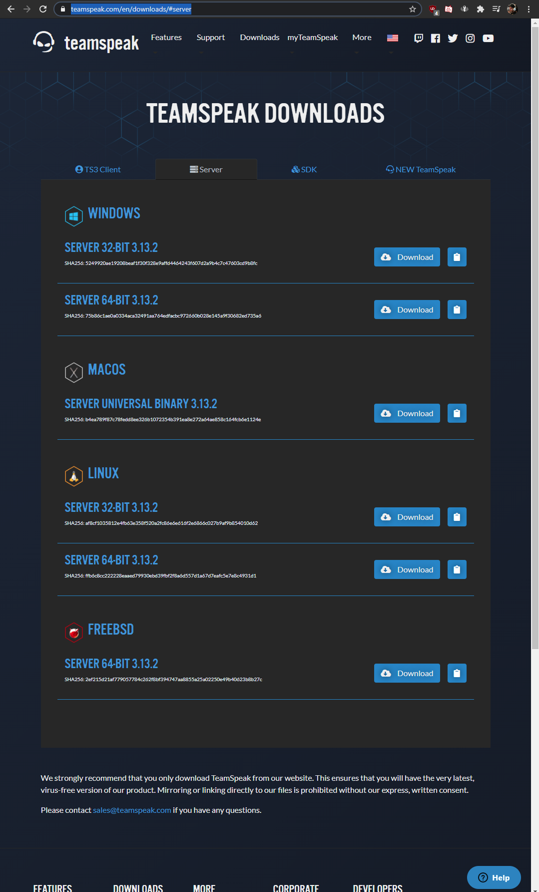

 # Oma Moduuli
 
 Aloitin varmistamalla koneeni olevan ajan tasalla, ajoin updatet ja restarttasin.
 
    $ sudo apt-get update
    $ sudo apt-get upgrade
    
Moduulin tarkoituksena on luoda teamspeak käyttäjä johon asennetaan teamspeak3 server ja hyväksytään automaattisesti ehdot ja käynnistetään palvelu yms. Moduuli perustuu oletukseen, että käyttöliittymänä on xubuntu-18.04.

# Käsin
Lähteenä käsintekoon: https://www.hostinger.com/tutorials/how-to-make-a-teamspeak-3-server/ 
Aloitetaan tekemällä käsin, loin ensin käyttäjän teamspeak, jolta disabloin kirjautumisen.

    $ sudo adduser --disabled-login teamspeak

Sitten selvitin miten teamspeak serverin lataus tapahtuu, ja mitä itse löysin oli että tiedosto täytyy ladata suoraan teamspeakin omilta sivuilta, ettei sitä saa ladattua suoraan paketinhallinnan kautta, joka on minulle saltin kanssa vielä uusi asia.

    $ cd /home/teamspeak/
    $ sudo wget https://files.teamspeak-services.com/releases/server/3.13.2/teamspeak3-server_linux_amd64-3.13.2.tar.bz2
    $ sudo tar xvf teamspeak3-server_linux_amd64-3.13.2.tar.bz2
    $ sudo rm teamspeak3-server_linux_amd64-3.13.2.tar.bz2
    $ cd teamspeak3-server_linux_amd64
    $ sudo mv * /home/teamspeak
    $ sudo rmdir teamspeak3-server_linux_amd64/
    
Tässä vaiheessa teamspeak3-server on ladattu, extractatty, ja siirretty /home/teamspeak/ directoryyn. 

Teamspeak3 serveristä pitää hyväksyä lisenssi, joka tapahtuu luomalla .ts3server_license_accepted tiedosto.
   
    $ sudo touch .ts3server_license_accepted
    
Luodaan teamspeak.service /lib/systemd/system/ directoryyn

    $ sudoedit /lib/systemd/system/teamspeak.service
    
johon lisätään 

    [Unit]
    Description=TeamSpeak 3 Server
    After=network.target
    [Service]
    WorkingDirectory=/home/teamspeak/
    User=teamspeak
    Group=teamspeak
    Type=forking
    ExecStart=/home/teamspeak/ts3server_startscript.sh start inifile=ts3server.ini
    ExecStop=/home/teamspeak/ts3server_startscript.sh stop
    PIDFile=/home/teamspeak/ts3server.pid
    RestartSec=15
    Restart=always
    [Install]
    WantedBy=multi-user.target
    
Sitten palvelun voi käynnistää komennoilla

    $ sudo systemctl enable teamspeak.service
    $ sudo systemctl start teamspeak.service
    
tarkistin toimivuuden 
 
    $ systemctl | grep teamspeak.service
    teamspeak.service                loaded active running   TeamSpeak 3 Server  
    
    $ systemctl status teamspeak.service 
    ● teamspeak.service - TeamSpeak 3 Server
     Loaded: loaded (/lib/systemd/system/teamspeak.service; enabled; vendor prese
     Active: active (running) since Wed 2020-12-16 19:25:25 EET; 2min 20s ago
     Process: 5071 ExecStart=/home/teamspeak/ts3server_startscript.sh start inifil
     Main PID: 5078 (ts3server)
     Tasks: 21 (limit: 4666)
     CGroup: /system.slice/teamspeak.service
           └─5078 ./ts3server inifile=ts3server.ini daemon=1 pid_file=ts3server

Näytti hyvältä. Nyt pitää vielä hakea privilegedkey /teamspeak/logs/ hakemistosta johon ei ole oikeuksia.

    $ sudo cat /home/teamspeak/logs/ts3server_*
    cat: '/home/teamspeak/logs/ts3server_*': No such file or directory
    $ cd /home/teamspeak/logs
    bash: cd: logs: Permission denied
    $ cd /home/teamspeak
    $ ls -la
    drwx------  2 teamspeak teamspeak     4096 joulu 16 19:25 logs
    $ sudo chmod o+rx
    $ cd logs
    $ ls
    ts3server_2020-12-16__17_25_25.551707_0.log  ts3server_2020-12-16__17_25_25.551707_1.log
    $ cat ts3server_2020-12-16__17_25_25.551707_1.log 
    2020-12-16 17:25:26.763688|INFO    |VirtualServerBase|1  |listening on 0.0.0.0:9987, [::]:9987
    2020-12-16 17:25:26.764028|WARNING |VirtualServer |1  |--------------------------------------------------------
    2020-12-16 17:25:26.764042|WARNING |VirtualServer |1  |ServerAdmin privilege key created, please use the line below
    2020-12-16 17:25:26.764051|WARNING |VirtualServer |1  |token=gYor1MTxKwuM1fAS+TDteO9jZIOKxNbKXpS1PNxA
    2020-12-16 17:25:26.764061|WARNING |VirtualServer |1  |--------------------------------------------------------

Sieltä löysimme tarvitsemamme tokenin jota tarvitaan ensimmäisellä yhdistyskerralla.

Sitten vielä latasin clientin ja yritin yhdistää servuun.

    $ sudo wget https://files.teamspeak-services.com/releases/client/3.5.6/TeamSpeak3-Client-linux_amd64-3.5.6.run
    $ sudo ./TeamSpeak3-Client-linux_amd64-3.5.6.run
Poistutaan lisenssin luvusta painamalla q ja hyväksytään lisenssi kirjoittamalla y

    Creating directory TeamSpeak3-Client-linux_amd64
    Verifying archive integrity... All good.
    Uncompressing TeamSpeak 3 Client for Linux on amd64  100%  

Avataan sovellus

    $ cd TeamSpeak3-Client-linux_amd64
    $ ./ts3client_runscript.sh

teamspeak ei tue sudolla avaamista joten saatiin tämmöinen error:

,kun avattiin normaalina käyttäjänä, mutta voidaan painaa ignore ja testata serveriä. Ylemmissä vaiheissa wget ja asennustiedoston ajamisessa ei olisi pitänyt käyttää sudoa, vaan antaa oikeudet chmodilla käyttäjälle ja toimia niin, ettei tulisi erroria. 

Tässä vaiheessa kuitenkin käytän clienttiä vain testatakseni serverin toimivuutta joten ei sillä väliä.

Ja tässä vaiheessa voidaan antaa token jolla saadaan serverin administrator oikeudet kyseiselle käyttäjälle.

Hyvin toimii ainakin käsin tehtynä, vielä jos tekisin toisin en sorkkisi sudoa kaikkiin kohtiin.
Voin nyt siirtyä saltilla automatisoimaan.

# SALT
Aloitin poistamalla käsin lataamani tiedostot jotta saan puhtaan alustan, jotta voin testata että moduulini varmasti toimii.

Pyrin poistamaan ja disabloimaan tekemäni askeleet takaperäisessä järkestyksessä.
     
     $ sudo systemctl stop teamspeak.service 
     $ sudo systemctl disable teamspeak.service 
     Removed /etc/systemd/system/multi-user.target.wants/teamspeak.service.
Tässä vaiheessa loin moduulin directoryn, johon voin säästää teamspeak.service tiedoston jota tulen tarvitsemaan jatkossa, ja samalla siirrän sen pois /lib/systemd/system/ directorysta, joka on tässä sama asia kun sen poistaminen.

     $ sudo mkdir /srv/salt/teamspeak
     $ cd /lib/systemd/system
     $ sudo mv teamspeak.service /srv/salt/teamspeak/.
Sitten poistin teamspeak serverin asennuskansion ja poistin teamspeak käyttäjän

     $ sudo rm -r /home/teamspeak
     $ sudo deluser teamspeak
     Removing user `teamspeak' ...
     Warning: group `teamspeak' has no more members.
     Done.
Nyt kun päästiin takaisin sellaiseen tilaan, ettei teamspeak käyttäjää tai teamspeak serveriä ole, voin luoda init.sls tiedoston joka pyrkii luomaan "teamspeak"-nimisen käyttäjän, lataamaan ja asentamaan teamspeak serverin, sekä pystyttämään sen. 

Aloitin käyttäjän luonnista.

     $ sudoedit init.sls
     teamspeak:
       user.present

Tätä testasin komennolla

    $ sudo salt '*' state.apply teamspeak
    noop:
    ----------
          ID: teamspeak
    Function: user.present
      Result: True
     Comment: New user teamspeak created
     Started: 20:53:47.556191
    Duration: 45.279 ms
     Changes:   
              ----------
              fullname:
              gid:
                  1003
              groups:
                  - teamspeak
              home:
                  /home/teamspeak
              homephone:
              name:
                  teamspeak
              passwd:
                  x
              roomnumber:
              shell:
                  /bin/sh
              uid:
                  1003
              workphone:

    Summary for noop
    ------------
    Succeeded: 1 (changed=1)
    Failed:    0
    ------------
    Total states run:     1
    Total run time:  45.279 ms

Oletuksena luotuna käyttäjä on juuri sellainen mikä halutaan, home kansio on oikea ja ilman että annettiin salasanaa, käyttäjä on disabloitu. 

     $ sudo deluser teamspeak
     $ cd /home/
     $ sudo rm -r teamspeak/
Poistin vielä tekemäni teamspeak käyttäjän ja sen home kansion testatakseni moduulin toimintaa kun lisään siihen ominaisuuksia.

     $ cd /srv/salt/teamspeak/
     $ sudoedit init.sls
     teamspeak:
       user.present
     download:
       file.managed:
         - name: /home/teamspeak/teamspeak3-server_linux_amd64-3.13.2.tar.bz2
         - source: https://files.teamspeak-services.com/releases/server/3.13.2/teamspeak3-server_linux_amd64-3.13.2.tar.bz2
         - source_hash: ffb6c8cc222228eaaed79930ebd39fbf2f8a6d557d1a67d7eafc5e7e8c4931d1

     $ sudo salt '*' state.apply teamspeak
    

Download sivuilla https://www.teamspeak.com/en/downloads/#server lukee sha256 checksum linux server 64bit alapuolella, joka annetaan kohdassa source_hash: tämä tarkistaa lataamamme tiedoston olevan sama kuin oletettu. Ilman hashia pitäisi käyttää skip_verifyTrue joka ignooraa source_hash: valuen remote file sourceilta, tämä ei ole suositeltavaa.

    $ sudoedit init.sls
    noop:
    ----------
          ID: teamspeak
    Function: user.present
      Result: True
     Comment: User teamspeak is present and up to date
     Started: 21:35:53.329723
    Duration: 17.425 ms
     Changes:   
    ----------
          ID: download
    Function: file.managed
        Name: /home/teamspeak/teamspeak3-server_linux_amd64-3.13.2.tar.bz2
      Result: True
     Comment: File /home/teamspeak/teamspeak3-server_linux_amd64-3.13.2.tar.bz2 updated
     Started: 21:35:53.348375
    Duration: 58.616 ms
     Changes:   
              ----------
              diff:
                  New file
              mode:
                  0644

    Summary for noop
    ------------
    Succeeded: 2 (changed=1)
    Failed:    0
    ------------
    Total states run:     2
    Total run time:  76.041 ms

Etsiessäni salt dokumentaatiosta miten extract toimii, löysin archive.extracted: tilan, joka lataa tiedoston ensin cacheen, ja sitten extractaa sen kohdekansioon, jolloin voin skipata file.managed latauksen jonka tein aikaisemmin. 

    $ sudoedit init.sls
    teamspeak:
      user.present
    download:
      archive.extracted:
        - name: /home/teamspeak/
        - source: https://files.teamspeak-services.com/releases/server/3.13.2/teamspeak3-server_linux_amd64-3.13.2.tar.bz2
        - source_hash: ffb6c8cc222228eaaed79930ebd39fbf2f8a6d557d1a67d7eafc5e7e8c4931d1
   
Jonka ajoin

     $ sudo salt '*' state.apply teamspeak
     noop:
    ----------
          ID: teamspeak
    Function: user.present
      Result: True
     Comment: User teamspeak is present and up to date
     Started: 21:53:33.473068
    Duration: 16.806 ms
     Changes:   
    ----------
          ID: extract
    Function: archive.extracted
        Name: /home/teamspeak/
      Result: True
     Comment: https://files.teamspeak-services.com/releases/server/3.13.2/teamspeak3-server_linux_amd64-3.13.2.tar.bz2 extracted to /home/teamspeak/, due to absence of one or more files/dirs
     Started: 21:53:33.490408
    Duration: 1930.366 ms
     Changes:   
              ----------
              extracted_files:
                  - teamspeak3-server_linux_amd64
                  - teamspeak3-server_linux_amd64/LICENSE
                  - teamspeak3-server_linux_amd64/tsdns
                  - teamspeak3-server_linux_amd64/tsdns/tsdnsserver
                  - teamspeak3-server_linux_amd64/tsdns/README
                  - teamspeak3-server_linux_amd64/tsdns/USAGE
                  - teamspeak3-server_linux_amd64/tsdns/tsdns_settings.ini.sample
                  - teamspeak3-server_linux_amd64/sql
                  - teamspeak3-server_linux_amd64/sql/group_member_delete.sql
                  - teamspeak3-server_linux_amd64/sql/update_sqlite_32.sql
                  - teamspeak3-server_linux_amd64/sql/update_28.sql
                  - teamspeak3-server_linux_amd64/sql/perm_insert_bulk.sql
                  - teamspeak3-server_linux_amd64/sql/channel_delete.sql
                  - teamspeak3-server_linux_amd64/sql/update_21.sql
                  - teamspeak3-server_linux_amd64/sql/api_key_delete.sql
                  - teamspeak3-server_linux_amd64/sql/complain_delete_prune.sql
                  - teamspeak3-server_linux_amd64/sql/groups_get_by_serverid_type.sql
                  - teamspeak3-server_linux_amd64/sql/update_16.sql
                  - teamspeak3-server_linux_amd64/sql/permission_load_channel_group_total.sql
                  - teamspeak3-server_linux_amd64/sql/update_15.sql
                  - teamspeak3-server_linux_amd64/sql/client_clear_traffic_stats.sql
                  - teamspeak3-server_linux_amd64/sql/ban_list.sql
                  - teamspeak3-server_linux_amd64/sql/client_get_by_id.sql
                  - teamspeak3-server_linux_amd64/sql/update_mariadb_32.sql
                  - teamspeak3-server_linux_amd64/sql/revocations_delete.sql
                  - teamspeak3-server_linux_amd64/sql/server_update_machine_id.sql
                  - teamspeak3-server_linux_amd64/sql/perm_update_get_groups.sql
                  - teamspeak3-server_linux_amd64/sql/update_34.sql
                  - teamspeak3-server_linux_amd64/sql/update_27.sql
                  - teamspeak3-server_linux_amd64/sql/group_member_get.sql
                  - teamspeak3-server_linux_amd64/sql/message_update_flag.sql
                  - teamspeak3-server_linux_amd64/sql/client_update_stats.sql
                  - teamspeak3-server_linux_amd64/sql/groups_get.sql
                  - teamspeak3-server_linux_amd64/sql/channel_insert.sql
                  - teamspeak3-server_linux_amd64/sql/client_count_queries.sql
                  - teamspeak3-server_linux_amd64/sql/group_member_delete_by_groupid.sql
                  - teamspeak3-server_linux_amd64/sql/update_24.sql
                  - teamspeak3-server_linux_amd64/sql/binding_delete.sql
                  - teamspeak3-server_linux_amd64/sql/channel_insert_bulk.sql
                  - teamspeak3-server_linux_amd64/sql/update_23.sql
                  - teamspeak3-server_linux_amd64/sql/info_get_by_ident.sql
                  - teamspeak3-server_linux_amd64/sql/client_delete_prune.sql
                  - teamspeak3-server_linux_amd64/sql/client_get_queries_per_server_limit.sql
                  - teamspeak3-server_linux_amd64/sql/properties_delete_by_string_id.sql
                  - teamspeak3-server_linux_amd64/sql/temporary_password_list.sql
                  - teamspeak3-server_linux_amd64/sql/channel_insert_bulk_fixup.sql
                  - teamspeak3-server_linux_amd64/sql/perm_group_copy.sql
                  - teamspeak3-server_linux_amd64/sql/custom_insert.sql
                  - teamspeak3-server_linux_amd64/sql/complain_get_by_serverid.sql
                  - teamspeak3-server_linux_amd64/sql/group_insert.sql
                  - teamspeak3-server_linux_amd64/sql/client_insert.sql
                  - teamspeak3-server_linux_amd64/sql/perm_copy_default_permissions.sql
                  - teamspeak3-server_linux_amd64/sql/properties_insert_by_string_id.sql
                  - teamspeak3-server_linux_amd64/sql/integration_action_list.sql
                  - teamspeak3-server_linux_amd64/sql/server_list_detailed.sql
                  - teamspeak3-server_linux_amd64/sql/token_list.sql
                  - teamspeak3-server_linux_amd64/sql/update_sqlite_33.sql
                  - teamspeak3-server_linux_amd64/sql/temporary_password_delete.sql
                  - teamspeak3-server_linux_amd64/sql/update_20.sql
                  - teamspeak3-server_linux_amd64/sql/complain_insert.sql
                  - teamspeak3-server_linux_amd64/sql/update_31.sql
                  - teamspeak3-server_linux_amd64/sql/client_get_by_serverid_bulk.sql
                  - teamspeak3-server_linux_amd64/sql/update_26.sql
                  - teamspeak3-server_linux_amd64/sql/channel_update_parentid.sql
                  - teamspeak3-server_linux_amd64/sql/api_key_insert.sql
                  - teamspeak3-server_linux_amd64/sql/client_remove_query_login.sql
                  - teamspeak3-server_linux_amd64/sql/create_postgresql
                  - teamspeak3-server_linux_amd64/sql/create_postgresql/drop_tables.sql
                  - teamspeak3-server_linux_amd64/sql/create_postgresql/create_tables.sql
                  - teamspeak3-server_linux_amd64/sql/create_postgresql/channel_insert_bulk_fixup.sql
                  - teamspeak3-server_linux_amd64/sql/create_postgresql/client_get_by_serverid_bulk.sql
                  - teamspeak3-server_linux_amd64/sql/create_postgresql/after_defaults.sql
                  - teamspeak3-server_linux_amd64/sql/client_get_by_name_or_uid.sql
                  - teamspeak3-server_linux_amd64/sql/update_19.sql
                  - teamspeak3-server_linux_amd64/sql/complain_delete_all.sql
                  - teamspeak3-server_linux_amd64/sql/token_delete_by_key.sql
                  - teamspeak3-server_linux_amd64/sql/group_id_get_by_name.sql
                  - teamspeak3-server_linux_amd64/sql/server_list_by_machine_id_detailed.sql
                  - teamspeak3-server_linux_amd64/sql/integration_action_insert.sql
                  - teamspeak3-server_linux_amd64/sql/group_rename.sql
                  - teamspeak3-server_linux_amd64/sql/integration_list.sql
                  - teamspeak3-server_linux_amd64/sql/update_mariadb_27.sql
                  - teamspeak3-server_linux_amd64/sql/channel_server_list_properties_bulk.sql
                  - teamspeak3-server_linux_amd64/sql/integration_insert.sql
                  - teamspeak3-server_linux_amd64/sql/update_mariadb_29.sql
                  - teamspeak3-server_linux_amd64/sql/ban_delete.sql
                  - teamspeak3-server_linux_amd64/sql/message_insert.sql
                  - teamspeak3-server_linux_amd64/sql/group_members_get_by_groupid.sql
                  - teamspeak3-server_linux_amd64/sql/properties_insert_by_id.sql
                  - teamspeak3-server_linux_amd64/sql/integration_action_delete.sql
                  - teamspeak3-server_linux_amd64/sql/perm_delete_by_groupid.sql
                  - teamspeak3-server_linux_amd64/sql/update_permissions_12.sql
                  - teamspeak3-server_linux_amd64/sql/update_mariadb_26.sql
                  - teamspeak3-server_linux_amd64/sql/defaults.sql
                  - teamspeak3-server_linux_amd64/sql/update_22.sql
                  - teamspeak3-server_linux_amd64/sql/permission_load_server_and_channel_group_total.sql
                  - teamspeak3-server_linux_amd64/sql/message_delete.sql
                  - teamspeak3-server_linux_amd64/sql/perm_delete_by_serverid.sql
                  - teamspeak3-server_linux_amd64/sql/perm_delete_by_permid.sql
                  - teamspeak3-server_linux_amd64/sql/perm_group_perm_copy.sql
                  - teamspeak3-server_linux_amd64/sql/update_13.sql
                  - teamspeak3-server_linux_amd64/sql/api_key_list.sql
                  - teamspeak3-server_linux_amd64/sql/client_get.sql
                  - teamspeak3-server_linux_amd64/sql/custom_get_by_ident.sql
                  - teamspeak3-server_linux_amd64/sql/group_member_detail_get_by_groupid.sql
                  - teamspeak3-server_linux_amd64/sql/client_delete.sql
                  - teamspeak3-server_linux_amd64/sql/perm_rename.sql
                  - teamspeak3-server_linux_amd64/sql/group_members_get_by_id.sql
                  - teamspeak3-server_linux_amd64/sql/server_snapshot_delete.sql
                  - teamspeak3-server_linux_amd64/sql/group_member_insert.sql
                  - teamspeak3-server_linux_amd64/sql/groups_get_by_serverid.sql
                  - teamspeak3-server_linux_amd64/sql/custom_get_by_id.sql
                  - teamspeak3-server_linux_amd64/sql/ban_insert.sql
                  - teamspeak3-server_linux_amd64/sql/channel_insert_bulk_mapping.sql
                  - teamspeak3-server_linux_amd64/sql/server_delete_get_qa_clients.sql
                  - teamspeak3-server_linux_amd64/sql/permission_load_other.sql
                  - teamspeak3-server_linux_amd64/sql/message_get_unread_by_clientid.sql
                  - teamspeak3-server_linux_amd64/sql/server_update_port.sql
                  - teamspeak3-server_linux_amd64/sql/bindings_insert.sql
                  - teamspeak3-server_linux_amd64/sql/update_25.sql
                  - teamspeak3-server_linux_amd64/sql/channel_properties_bulk_insert.sql
                  - teamspeak3-server_linux_amd64/sql/custom_delete.sql
                  - teamspeak3-server_linux_amd64/sql/client_get_by_uid.sql
                  - teamspeak3-server_linux_amd64/sql/info_insert.sql
                  - teamspeak3-server_linux_amd64/sql/temporary_password_insert.sql
                  - teamspeak3-server_linux_amd64/sql/server_update_autostart.sql
                  - teamspeak3-server_linux_amd64/sql/revocations_getlist.sql
                  - teamspeak3-server_linux_amd64/sql/update_mariadb_28.sql
                  - teamspeak3-server_linux_amd64/sql/server_get_byport.sql
                  - teamspeak3-server_linux_amd64/sql/perm_group_get_mapping.sql
                  - teamspeak3-server_linux_amd64/sql/update_sqlite_29.sql
                  - teamspeak3-server_linux_amd64/sql/client_get_by_serverid_limit.sql
                  - teamspeak3-server_linux_amd64/sql/group_delete.sql
                  - teamspeak3-server_linux_amd64/sql/update_12.sql
                  - teamspeak3-server_linux_amd64/sql/updates_and_fixes
                  - teamspeak3-server_linux_amd64/sql/updates_and_fixes/mariadb_fix_latin_utf8.sql
                  - teamspeak3-server_linux_amd64/sql/updates_and_fixes/convert_mysql_to_mariadb.sql
                  - teamspeak3-server_linux_amd64/sql/create_mariadb
                  - teamspeak3-server_linux_amd64/sql/create_mariadb/drop_tables.sql
                  - teamspeak3-server_linux_amd64/sql/create_mariadb/create_tables.sql
                  - teamspeak3-server_linux_amd64/sql/channel_server_list.sql
                  - teamspeak3-server_linux_amd64/sql/permission_load_server_group_total.sql
                  - teamspeak3-server_linux_amd64/sql/perm_insert.sql
                  - teamspeak3-server_linux_amd64/sql/message_get_by_clientid.sql
                  - teamspeak3-server_linux_amd64/sql/properties_list_by_id.sql
                  - teamspeak3-server_linux_amd64/sql/perm_get_by_serverid.sql
                  - teamspeak3-server_linux_amd64/sql/client_get_queries_limit.sql
                  - teamspeak3-server_linux_amd64/sql/clientid_get_by_name_pw_serverid.sql
                  - teamspeak3-server_linux_amd64/sql/update_29.sql
                  - teamspeak3-server_linux_amd64/sql/client_update_login_info.sql
                  - teamspeak3-server_linux_amd64/sql/server_delete.sql
                  - teamspeak3-server_linux_amd64/sql/bindings_list.sql
                  - teamspeak3-server_linux_amd64/sql/custom_update.sql
                  - teamspeak3-server_linux_amd64/sql/client_insert_bulk.sql
                  - teamspeak3-server_linux_amd64/sql/update_14.sql
                  - teamspeak3-server_linux_amd64/sql/client_insert_query.sql
                  - teamspeak3-server_linux_amd64/sql/update_sqlite_28.sql
                  - teamspeak3-server_linux_amd64/sql/client_insert_bulk_mapping.sql
                  - teamspeak3-server_linux_amd64/sql/server_update_traffic_stats.sql
                  - teamspeak3-server_linux_amd64/sql/channel_delete_bulk.sql
                  - teamspeak3-server_linux_amd64/sql/update_30.sql
                  - teamspeak3-server_linux_amd64/sql/update_mariadb_33.sql
                  - teamspeak3-server_linux_amd64/sql/complain_delete.sql
                  - teamspeak3-server_linux_amd64/sql/client_get_by_serverid.sql
                  - teamspeak3-server_linux_amd64/sql/server_snapshot_delete_failed.sql
                  - teamspeak3-server_linux_amd64/sql/update_postgresql_33.sql
                  - teamspeak3-server_linux_amd64/sql/perm_get_by_id.sql
                  - teamspeak3-server_linux_amd64/sql/update_33.sql
                  - teamspeak3-server_linux_amd64/sql/create_sqlite
                  - teamspeak3-server_linux_amd64/sql/create_sqlite/drop_tables.sql
                  - teamspeak3-server_linux_amd64/sql/create_sqlite/create_tables.sql
                  - teamspeak3-server_linux_amd64/sql/revocations_insert_bulk.sql
                  - teamspeak3-server_linux_amd64/sql/properties_list_by_string_id.sql
                  - teamspeak3-server_linux_amd64/sql/message_list_by_clientid.sql
                  - teamspeak3-server_linux_amd64/sql/token_insert.sql
                  - teamspeak3-server_linux_amd64/sql/update_32.sql
                  - teamspeak3-server_linux_amd64/sql/client_update_traffic_stats.sql
                  - teamspeak3-server_linux_amd64/sql/group_insert_bulk_snapshot_get_mapping.sql
                  - teamspeak3-server_linux_amd64/sql/client_properties_bulk_insert.sql
                  - teamspeak3-server_linux_amd64/sql/group_member_insert_bulk.sql
                  - teamspeak3-server_linux_amd64/sql/server_get_byid.sql
                  - teamspeak3-server_linux_amd64/sql/properties_delete_by_id.sql
                  - teamspeak3-server_linux_amd64/sql/integration_delete.sql
                  - teamspeak3-server_linux_amd64/sql/server_list.sql
                  - teamspeak3-server_linux_amd64/sql/update_18.sql
                  - teamspeak3-server_linux_amd64/sql/server_list_by_machine_id.sql
                  - teamspeak3-server_linux_amd64/sql/server_clear_traffic_stats.sql
                  - teamspeak3-server_linux_amd64/sql/server_insert.sql
                  - teamspeak3-server_linux_amd64/sql/client_count_by_serverid.sql
                  - teamspeak3-server_linux_amd64/sql/update_sqlite_27.sql
                  - teamspeak3-server_linux_amd64/sql/update_database_version.sql
                  - teamspeak3-server_linux_amd64/sql/client_update_name.sql
                  - teamspeak3-server_linux_amd64/sql/group_insert_bulk_snapshot.sql
                  - teamspeak3-server_linux_amd64/sql/client_count_queries_per_server.sql
                  - teamspeak3-server_linux_amd64/sql/clientid_get_by_name_pw.sql
                  - teamspeak3-server_linux_amd64/sql/info_delete.sql
                  - teamspeak3-server_linux_amd64/sql/group_members_get_by_serverid.sql
                  - teamspeak3-server_linux_amd64/sql/update_17.sql
                  - teamspeak3-server_linux_amd64/sql/token_get_by_key.sql
                  - teamspeak3-server_linux_amd64/ts3server
                  - teamspeak3-server_linux_amd64/libts3db_sqlite3.so
                  - teamspeak3-server_linux_amd64/libts3db_postgresql.so
                  - teamspeak3-server_linux_amd64/doc
                  - teamspeak3-server_linux_amd64/doc/serverquery
                  - teamspeak3-server_linux_amd64/doc/serverquery/serverquery.html
                  - teamspeak3-server_linux_amd64/doc/serverquery/TeamSpeak_Logo.png
                  - teamspeak3-server_linux_amd64/doc/serverquery/stylesheet.css
                  - teamspeak3-server_linux_amd64/doc/privilegekey_guide.txt
                  - teamspeak3-server_linux_amd64/doc/accounting.txt
                  - teamspeak3-server_linux_amd64/doc/server_quickstart.md
                  - teamspeak3-server_linux_amd64/doc/permissiondoc.txt
                  - teamspeak3-server_linux_amd64/doc/server_upgrade.txt
                  - teamspeak3-server_linux_amd64/doc/update_mysql_to_mariadb.txt
                  - teamspeak3-server_linux_amd64/doc/webquery.md
                  - teamspeak3-server_linux_amd64/ts3server_startscript.sh
                  - teamspeak3-server_linux_amd64/libts3db_mariadb.so
                  - teamspeak3-server_linux_amd64/redist
                  - teamspeak3-server_linux_amd64/redist/libmariadb.so.2
                  - teamspeak3-server_linux_amd64/ts3server_minimal_runscript.sh
                  - teamspeak3-server_linux_amd64/libts3_ssh.so
                  - teamspeak3-server_linux_amd64/serverquerydocs
                  - teamspeak3-server_linux_amd64/serverquerydocs/apikeylist.txt
                  - teamspeak3-server_linux_amd64/serverquerydocs/tokendelete.txt
                  - teamspeak3-server_linux_amd64/serverquerydocs/clientgetnamefromuid.txt
                  - teamspeak3-server_linux_amd64/serverquerydocs/quit.txt
                  - teamspeak3-server_linux_amd64/serverquerydocs/instanceedit.txt
                  - teamspeak3-server_linux_amd64/serverquerydocs/ftgetfilelist.txt
                  - teamspeak3-server_linux_amd64/serverquerydocs/clientpermlist.txt
                  - teamspeak3-server_linux_amd64/serverquerydocs/tokenuse.txt
                  - teamspeak3-server_linux_amd64/serverquerydocs/serverstart.txt
                  - teamspeak3-server_linux_amd64/serverquerydocs/servernotifyregister.txt
                  - teamspeak3-server_linux_amd64/serverquerydocs/complaindel.txt
                  - teamspeak3-server_linux_amd64/serverquerydocs/clientdelperm.txt
                  - teamspeak3-server_linux_amd64/serverquerydocs/logview.txt
                  - teamspeak3-server_linux_amd64/serverquerydocs/channeldelperm.txt
                  - teamspeak3-server_linux_amd64/serverquerydocs/permoverview.txt
                  - teamspeak3-server_linux_amd64/serverquerydocs/servergroupdel.txt
                  - teamspeak3-server_linux_amd64/serverquerydocs/clientgetnamefromdbid.txt
                  - teamspeak3-server_linux_amd64/serverquerydocs/channelgroupdelperm.txt
                  - teamspeak3-server_linux_amd64/serverquerydocs/logadd.txt
                  - teamspeak3-server_linux_amd64/serverquerydocs/clientdbedit.txt
                  - teamspeak3-server_linux_amd64/serverquerydocs/querylogindel.txt
                  - teamspeak3-server_linux_amd64/serverquerydocs/apikeydel.txt
                  - teamspeak3-server_linux_amd64/serverquerydocs/clientdelservergroup.txt
                  - teamspeak3-server_linux_amd64/serverquerydocs/serverlist.txt
                  - teamspeak3-server_linux_amd64/serverquerydocs/ftdeletefile.txt
                  - teamspeak3-server_linux_amd64/serverquerydocs/clientkick.txt
                  - teamspeak3-server_linux_amd64/serverquerydocs/channelclientdelperm.txt
                  - teamspeak3-server_linux_amd64/serverquerydocs/servertemppasswordadd.txt
                  - teamspeak3-server_linux_amd64/serverquerydocs/clientgetuidfromclid.txt
                  - teamspeak3-server_linux_amd64/serverquerydocs/messageget.txt
                  - teamspeak3-server_linux_amd64/serverquerydocs/serverrequestconnectioninfo.txt
                  - teamspeak3-server_linux_amd64/serverquerydocs/serversnapshotdeploy.txt
                  - teamspeak3-server_linux_amd64/serverquerydocs/customsearch.txt
                  - teamspeak3-server_linux_amd64/serverquerydocs/privilegekeyuse.txt
                  - teamspeak3-server_linux_amd64/serverquerydocs/servergroupdelclient.txt
                  - teamspeak3-server_linux_amd64/serverquerydocs/ftgetfileinfo.txt
                  - teamspeak3-server_linux_amd64/serverquerydocs/custominfo.txt
                  - teamspeak3-server_linux_amd64/serverquerydocs/banclient.txt
                  - teamspeak3-server_linux_amd64/serverquerydocs/clientgetdbidfromuid.txt
                  - teamspeak3-server_linux_amd64/serverquerydocs/servergrouppermlist.txt
                  - teamspeak3-server_linux_amd64/serverquerydocs/instanceinfo.txt
                  - teamspeak3-server_linux_amd64/serverquerydocs/channeldelete.txt
                  - teamspeak3-server_linux_amd64/serverquerydocs/serversnapshotcreate.txt
                  - teamspeak3-server_linux_amd64/serverquerydocs/clientinfo.txt
                  - teamspeak3-server_linux_amd64/serverquerydocs/channelgroupdel.txt
                  - teamspeak3-server_linux_amd64/serverquerydocs/servergroupcopy.txt
                  - teamspeak3-server_linux_amd64/serverquerydocs/complainadd.txt
                  - teamspeak3-server_linux_amd64/serverquerydocs/channelclientaddperm.txt
                  - teamspeak3-server_linux_amd64/serverquerydocs/clientdbfind.txt
                  - teamspeak3-server_linux_amd64/serverquerydocs/clientdbdelete.txt
                  - teamspeak3-server_linux_amd64/serverquerydocs/channelgroupclientlist.txt
                  - teamspeak3-server_linux_amd64/serverquerydocs/servergroupaddperm.txt
                  - teamspeak3-server_linux_amd64/serverquerydocs/servergroupadd.txt
                  - teamspeak3-server_linux_amd64/serverquerydocs/banlist.txt
                  - teamspeak3-server_linux_amd64/serverquerydocs/tokenlist.txt
                  - teamspeak3-server_linux_amd64/serverquerydocs/messageadd.txt
                  - teamspeak3-server_linux_amd64/serverquerydocs/queryloginlist.txt
                  - teamspeak3-server_linux_amd64/serverquerydocs/setclientchannelgroup.txt
                  - teamspeak3-server_linux_amd64/serverquerydocs/clientaddperm.txt
                  - teamspeak3-server_linux_amd64/serverquerydocs/channelcreate.txt
                  - teamspeak3-server_linux_amd64/serverquerydocs/sendtextmessage.txt
                  - teamspeak3-server_linux_amd64/serverquerydocs/logout.txt
                  - teamspeak3-server_linux_amd64/serverquerydocs/bindinglist.txt
                  - teamspeak3-server_linux_amd64/serverquerydocs/hostinfo.txt
                  - teamspeak3-server_linux_amd64/serverquerydocs/messageupdateflag.txt
                  - teamspeak3-server_linux_amd64/serverquerydocs/serverdelete.txt
                  - teamspeak3-server_linux_amd64/serverquerydocs/channelclientpermlist.txt
                  - teamspeak3-server_linux_amd64/serverquerydocs/complaindelall.txt
                  - teamspeak3-server_linux_amd64/serverquerydocs/bandel.txt
                  - teamspeak3-server_linux_amd64/serverquerydocs/queryloginadd.txt
                  - teamspeak3-server_linux_amd64/serverquerydocs/servergrouprename.txt
                  - teamspeak3-server_linux_amd64/serverquerydocs/help.txt
                  - teamspeak3-server_linux_amd64/serverquerydocs/channelgroupcopy.txt
                  - teamspeak3-server_linux_amd64/serverquerydocs/serverinfo.txt
                  - teamspeak3-server_linux_amd64/serverquerydocs/servertemppasswordlist.txt
                  - teamspeak3-server_linux_amd64/serverquerydocs/channellist.txt
                  - teamspeak3-server_linux_amd64/serverquerydocs/privilegekeydelete.txt
                  - teamspeak3-server_linux_amd64/serverquerydocs/permfind.txt
                  - teamspeak3-server_linux_amd64/serverquerydocs/serveredit.txt
                  - teamspeak3-server_linux_amd64/serverquerydocs/serverstop.txt
                  - teamspeak3-server_linux_amd64/serverquerydocs/privilegekeylist.txt
                  - teamspeak3-server_linux_amd64/serverquerydocs/use.txt
                  - teamspeak3-server_linux_amd64/serverquerydocs/apikeyadd.txt
                  - teamspeak3-server_linux_amd64/serverquerydocs/channelmove.txt
                  - teamspeak3-server_linux_amd64/serverquerydocs/clientdblist.txt
                  - teamspeak3-server_linux_amd64/serverquerydocs/ftlist.txt
                  - teamspeak3-server_linux_amd64/serverquerydocs/permidgetbyname.txt
                  - teamspeak3-server_linux_amd64/serverquerydocs/permreset.txt
                  - teamspeak3-server_linux_amd64/serverquerydocs/serveridgetbyport.txt
                  - teamspeak3-server_linux_amd64/serverquerydocs/channeladdperm.txt
                  - teamspeak3-server_linux_amd64/serverquerydocs/servergroupaddclient.txt
                  - teamspeak3-server_linux_amd64/serverquerydocs/servernotifyunregister.txt
                  - teamspeak3-server_linux_amd64/serverquerydocs/clientedit.txt
                  - teamspeak3-server_linux_amd64/serverquerydocs/ftrenamefile.txt
                  - teamspeak3-server_linux_amd64/serverquerydocs/customdelete.txt
                  - teamspeak3-server_linux_amd64/serverquerydocs/servertemppassworddel.txt
                  - teamspeak3-server_linux_amd64/serverquerydocs/tokenadd.txt
                  - teamspeak3-server_linux_amd64/serverquerydocs/banadd.txt
                  - teamspeak3-server_linux_amd64/serverquerydocs/clientfind.txt
                  - teamspeak3-server_linux_amd64/serverquerydocs/bandelall.txt
                  - teamspeak3-server_linux_amd64/serverquerydocs/gm.txt
                  - teamspeak3-server_linux_amd64/serverquerydocs/complainlist.txt
                  - teamspeak3-server_linux_amd64/serverquerydocs/clientsetserverquerylogin.txt
                  - teamspeak3-server_linux_amd64/serverquerydocs/clientpoke.txt
                  - teamspeak3-server_linux_amd64/serverquerydocs/clientgetids.txt
                  - teamspeak3-server_linux_amd64/serverquerydocs/ftinitupload.txt
                  - teamspeak3-server_linux_amd64/serverquerydocs/permget.txt
                  - teamspeak3-server_linux_amd64/serverquerydocs/servergroupclientlist.txt
                  - teamspeak3-server_linux_amd64/serverquerydocs/servergroupsbyclientid.txt
                  - teamspeak3-server_linux_amd64/serverquerydocs/customset.txt
                  - teamspeak3-server_linux_amd64/serverquerydocs/messagedel.txt
                  - teamspeak3-server_linux_amd64/serverquerydocs/ftinitdownload.txt
                  - teamspeak3-server_linux_amd64/serverquerydocs/privilegekeyadd.txt
                  - teamspeak3-server_linux_amd64/serverquerydocs/channelgrouppermlist.txt
                  - teamspeak3-server_linux_amd64/serverquerydocs/permissionlist.txt
                  - teamspeak3-server_linux_amd64/serverquerydocs/version.txt
                  - teamspeak3-server_linux_amd64/serverquerydocs/clientlist.txt
                  - teamspeak3-server_linux_amd64/serverquerydocs/whoami.txt
                  - teamspeak3-server_linux_amd64/serverquerydocs/serverprocessstop.txt
                  - teamspeak3-server_linux_amd64/serverquerydocs/channelpermlist.txt
                  - teamspeak3-server_linux_amd64/serverquerydocs/servergroupautodelperm.txt
                  - teamspeak3-server_linux_amd64/serverquerydocs/servercreate.txt
                  - teamspeak3-server_linux_amd64/serverquerydocs/channelgroupadd.txt
                  - teamspeak3-server_linux_amd64/serverquerydocs/ftcreatedir.txt
                  - teamspeak3-server_linux_amd64/serverquerydocs/channelfind.txt
                  - teamspeak3-server_linux_amd64/serverquerydocs/login.txt
                  - teamspeak3-server_linux_amd64/serverquerydocs/servergrouplist.txt
                  - teamspeak3-server_linux_amd64/serverquerydocs/messagelist.txt
                  - teamspeak3-server_linux_amd64/serverquerydocs/clientdbinfo.txt
                  - teamspeak3-server_linux_amd64/serverquerydocs/channelgrouplist.txt
                  - teamspeak3-server_linux_amd64/serverquerydocs/clientaddservergroup.txt
                  - teamspeak3-server_linux_amd64/serverquerydocs/channelinfo.txt
                  - teamspeak3-server_linux_amd64/serverquerydocs/channelgroupaddperm.txt
                  - teamspeak3-server_linux_amd64/serverquerydocs/channeledit.txt
                  - teamspeak3-server_linux_amd64/serverquerydocs/channelgrouprename.txt
                  - teamspeak3-server_linux_amd64/serverquerydocs/clientupdate.txt
                  - teamspeak3-server_linux_amd64/serverquerydocs/servergroupdelperm.txt
                  - teamspeak3-server_linux_amd64/serverquerydocs/servergroupautoaddperm.txt
                  - teamspeak3-server_linux_amd64/serverquerydocs/ftstop.txt
                  - teamspeak3-server_linux_amd64/serverquerydocs/clientmove.txt
                  - teamspeak3-server_linux_amd64/CHANGELOG

    Summary for noop
    ------------
    Succeeded: 2 (changed=1)
    Failed:    0
    ------------
    Total states run:     2
    Total run time:   1.947 s

Tila toimi, mainiota!

    /home/teamspeak$ ls
    teamspeak3-server_linux_amd64

Vai toimiko? tiedosto extractaantui omaan kansioonsa teamspeak3-server_linux_amd64, noh ei sillä ole paljoaa merkitystä, täytyy vain tehdä tarvittavat muunnokset konfiguraatiotiedostoon ennen kuin se viedään paikalleen, ja luoda .ts3server_license_accepted tiedosto.

    $ cd /srv/salt/teamspeak/
    $ sudo touch .ts3server_license_accepted
    $ sudoedit teamspeak.service
    
    [Unit]
    Description=TeamSpeak 3 Server
    After=network.target
    [Service]
    WorkingDirectory=/home/teamspeak/teamspeak3-server_linux_amd64/
    User=teamspeak
    Group=teamspeak
    Type=forking
    ExecStart=/home/teamspeak/teamspeak3-server_linux_amd64/ts3server_startscript.sh start inifile=ts3server.ini
    ExecStop=/home/teamspeak/teamspeak3-server_linux_amd64/ts3server_startscript.sh stop
    PIDFile=/home/teamspeak/teamspeak3-server_linux_amd64/ts3server.pid
    RestartSec=15
    Restart=always
    [Install]
    WantedBy=multi-user.target

Lisätään init.sls tiedostoon pari file.managed tilaa.

    $ sudoedit init.sls
    
    teamspeakuser:
       user.present:
        - name: teamspeak
    extract:
      archive.extracted:
        - name: /home/teamspeak/
        - source: https://files.teamspeak-services.com/releases/server/3.13.2/teamspeak3-server_linux_amd64-3.13.2.tar.bz2
        - source_hash: ffb6c8cc222228eaaed79930ebd39fbf2f8a6d557d1a67d7eafc5e7e8c4931d1
    /home/teamspeak/teamspeak3-server_linux_amd64/.ts3server_license_accepted:
      file.managed:
        - source: salt://teamspeak/.ts3server_license_accepted
    /lib/systemd/system/teamspeak.service:
      file.managed:
        - source: salt://teamspeak/teamspeak.service
Tein myös muutoksen teamspeak käyttäjän luontiin, koska siitä voi koitua ongelmia teamspeak.service :n service.running tilan luonnissa seuraavaksi.

     $ sudo salt '*' state.apply teamspeak
     
     ----------
          ID: teamspeakuser
    Function: user.present
        Name: teamspeak
      Result: True
     Comment: User teamspeak is present and up to date
     Started: 22:20:37.571427
    Duration: 16.762 ms
     Changes:   
     ----------
          ID: extract
    Function: archive.extracted
        Name: /home/teamspeak/
      Result: True
     Comment: All files in archive are already present
     Started: 22:20:37.588783
    Duration: 879.093 ms
     Changes:   
          ID: /home/teamspeak/teamspeak3-server_linux_amd64/.ts3server_license_accepted
    Function: file.managed
      Result: True
     Comment: File /home/teamspeak/teamspeak3-server_linux_amd64/.ts3server_license_accepted updated
     Started: 22:21:51.212453
    Duration: 8.574 ms
     Changes:   
     ----------
    diff:
    New file
    mode:
    0644
     ----------
          ID: /lib/systemd/system/teamspeak.service
    Function: file.managed
      Result: True
     Comment: File /lib/systemd/system/teamspeak.service updated
     Started: 22:20:38.470843
    Duration: 9.69 ms
     Changes:   
    ----------
    diff:
    New file
    mode:
    0644

    Summary for noop
    ------------
    Succeeded: 4 (changed=2)
    Failed:    0
    ------------
    Total states run:     4
    Total run time: 903.065 ms

Tiedostojen vieminen toimi, eikä userin luontiin tekemistä muutoksista koitunut ongelmia.

nyt kun systemd lisätään teamspeak.service tiedosto, voidaan init.sls lisätä service.running tila, joka potkaisee teamspeak serverin käyntiin asennuksen yhteydessä.

    $ sudoedit init.sls
    
    teamspeakuser:
      user.present:
        - name: teamspeak
    extract:
      archive.extracted:
        - name: /home/teamspeak/
        - source: https://files.teamspeak-services.com/releases/server/3.13.2/teamspeak3-server_linux_amd64-3.13.2.tar.bz2
        - source_hash: ffb6c8cc222228eaaed79930ebd39fbf2f8a6d557d1a67d7eafc5e7e8c4931d1
    /home/teamspeak/teamspeak3-server_linux_amd64/.ts3server_license_accepted:
      file.managed:
        - source: salt://teamspeak/.ts3server_license_accepted
    /lib/systemd/system/teamspeak.service:
      file.managed:
        - source: salt://teamspeak/teamspeak.service
    teamspeakservice:
      service.running:
        - name: teamspeak

testasin.

    $ sudo salt '*' state.apply teamspeak
    
    ...
    ----------
          ID: teamspeakservice
    Function: service.running
        Name: teamspeak
      Result: False
     Comment: Job for teamspeak.service failed because a timeout was exceeded.
              See "systemctl status teamspeak.service" and "journalctl -xe" for details.
     Started: 22:34:21.916079
    Duration: 90245.155 ms
     Changes:   

    Summary for noop
    ------------
    Succeeded: 4
    Failed:    1
    ------------
    Total states run:     5
    Total run time:  91.200 s
    ERROR: Minions returned with non-zero exit code

error, tila ei toiminut. Siis juurikin tämä äsken lisäämä service.running tila. Koitetaan debugata.

    $ sudo systemctl status teamspeak.service
    ● teamspeak.service - TeamSpeak 3 Server
    Loaded: loaded (/lib/systemd/system/teamspeak.service; disabled; vendor preset: enabled)
    Active: activating (start) since Wed 2020-12-16 22:36:07 EET; 48s ago
    Process: 11636 ExecStart=/home/teamspeak/teamspeak3-server_linux_amd64/ts3server_startscript.sh start inifile=ts3server.ini (code=exited, status=0/SUCCESS)
    Tasks: 0 (limit: 4666)
     CGroup: /system.slice/teamspeak.service

    joulu 16 22:36:07 noop systemd[1]: teamspeak.service: Service hold-off time over, scheduling restart.
    joulu 16 22:36:07 noop systemd[1]: teamspeak.service: Scheduled restart job, restart counter is at 1.
    joulu 16 22:36:07 noop systemd[1]: Stopped TeamSpeak 3 Server.
    joulu 16 22:36:07 noop systemd[1]: Starting TeamSpeak 3 Server...
    joulu 16 22:36:07 noop ts3server_startscript.sh[11636]: Starting the TeamSpeak 3 server
    joulu 16 22:36:07 noop ts3server_startscript.sh[11636]: TeamSpeak 3 server started, for details please view the log file
    joulu 16 22:36:07 noop systemd[1]: teamspeak.service: Can't open PID file /home/teamspeak/teamspeak3-server_linux_amd64/ts3server.pid (yet?) after start: No such file or directory
    joulu 16 22:36:07 noop ts3server_startscript.sh[11636]: ERROR: openFile( file:logs/ts3server_2020-12-16__20_36_07.412630_0.log) failed
    joulu 16 22:36:07 noop ts3server_startscript.sh[11636]: 2020-12-16 20:36:07.413129|CRITICAL|ServerLibPriv |   |Server() DatabaseError out of memory
    joulu 16 22:36:07 noop ts3server_startscript.sh[11636]: ERROR: openFile( file:logs/ts3server_2020-12-16__20_36_07.412630_0.log) failed
ja 

    $ sudo journalctl -xe
    joulu 16 22:37:52 noop ts3server_startscript.sh[11677]: ERROR: openFile( file:logs/ts3server_2020-12-16__20_37_52.911527_0.log) failed
    joulu 16 22:37:52 noop ts3server_startscript.sh[11677]: 2020-12-16 20:37:52.912043|CRITICAL|ServerLibPriv |   |Server() DatabaseError out of memory
    joulu 16 22:37:52 noop ts3server_startscript.sh[11677]: ERROR: openFile( file:logs/ts3server_2020-12-16__20_37_52.911527_0.log) failed
    joulu 16 22:39:00 noop systemd[1]: Starting Clean php session files...
    -- Subject: Unit phpsessionclean.service has begun start-up
    -- Defined-By: systemd
    -- Support: http://www.ubuntu.com/support
    -- 
    -- Unit phpsessionclean.service has begun starting up.
    joulu 16 22:39:00 noop systemd[1]: Started Clean php session files.
    -- Subject: Unit phpsessionclean.service has finished start-up
    -- Defined-By: systemd
    -- Support: http://www.ubuntu.com/support
    -- 
    -- Unit phpsessionclean.service has finished starting up.
    -- 
    -- The start-up result is RESULT.
    joulu 16 22:39:01 noop CRON[11770]: pam_unix(cron:session): session opened for user root by (uid=0)
    joulu 16 22:39:01 noop CRON[11771]: (root) CMD (  [ -x /usr/lib/php/sessionclean ] && if [ ! -d /run/systemd/system ]; then /usr/lib/php/sessionclean; fi)
    joulu 16 22:39:01 noop CRON[11770]: pam_unix(cron:session): session closed for user root
    joulu 16 22:39:23 noop systemd[1]: teamspeak.service: Start operation timed out. Terminating.
    joulu 16 22:39:23 noop systemd[1]: teamspeak.service: Failed with result 'timeout'.
     joulu 16 22:39:23 noop systemd[1]: Failed to start TeamSpeak 3 Server.
    -- Subject: Unit teamspeak.service has failed
    -- Defined-By: systemd
    -- Support: http://www.ubuntu.com/support
    -- 
    -- Unit teamspeak.service has failed.
    -- 
    -- The result is RESULT.
    joulu 16 22:39:38 noop systemd[1]: teamspeak.service: Service hold-off time over, scheduling restart.
    joulu 16 22:39:38 noop systemd[1]: teamspeak.service: Scheduled restart job, restart counter is at 3.
    -- Subject: Automatic restarting of a unit has been scheduled
    -- Defined-By: systemd
    -- Support: http://www.ubuntu.com/support
    -- 
    -- Automatic restarting of the unit teamspeak.service has been scheduled, as the result for
    -- the configured Restart= setting for the unit.
    joulu 16 22:39:38 noop systemd[1]: Stopped TeamSpeak 3 Server.
    -- Subject: Unit teamspeak.service has finished shutting down
    -- Defined-By: systemd
    -- Support: http://www.ubuntu.com/support
    -- 
    -- Unit teamspeak.service has finished shutting down.
    joulu 16 22:39:38 noop systemd[1]: Starting TeamSpeak 3 Server...
    -- Subject: Unit teamspeak.service has begun start-up
    -- Defined-By: systemd
    -- Support: http://www.ubuntu.com/support
    -- 
    -- Unit teamspeak.service has begun starting up.
    joulu 16 22:39:38 noop ts3server_startscript.sh[11772]: Starting the TeamSpeak 3 server
    joulu 16 22:39:38 noop ts3server_startscript.sh[11772]: TeamSpeak 3 server started, for details please view the log file
    joulu 16 22:39:38 noop systemd[1]: teamspeak.service: Can't open PID file /home/teamspeak/teamspeak3-server_linux_amd64/ts3server.pid (yet?) after start: No such file or directory
    joulu 16 22:39:38 noop ts3server_startscript.sh[11772]: ERROR: openFile( file:logs/ts3server_2020-12-16__20_39_38.412392_0.log) failed
    joulu 16 22:39:38 noop ts3server_startscript.sh[11772]: 2020-12-16 20:39:38.412893|CRITICAL|ServerLibPriv |   |Server() DatabaseError out of memory
    joulu 16 22:39:38 noop ts3server_startscript.sh[11772]: ERROR: openFile( file:logs/ts3server_2020-12-16__20_39_38.412392_0.log) failed
    joulu 16 22:39:57 noop sudo[11782]:     aatu : TTY=pts/0 ; PWD=/srv/salt/teamspeak ; USER=root ; COMMAND=/bin/journalctl -xe
    joulu 16 22:39:57 noop sudo[11782]: pam_unix(sudo:session): session opened for user root by (uid=0)

Vikana lienee ongelma tiedostojen ja kansioiden oikeuksissa. Orjalla ei ole oikeuksia kaikkiin tiedostoihin teamspeak directoryssa, jotka omistaa root.

Tehdään sellaiset muutokset, että teamspeak käyttäjä ja ryhmä omistaa tiedostot ja directoryt jotka luodaan/extractataan.

    $ cd /srv/salt/teamspeak
    $ sudoedit init.sls
    
    teamspeakuser:
      user.present:
        - name: teamspeak
    extract:
      archive.extracted:
        - name: /home/teamspeak/
        - source: https://files.teamspeak-services.com/releases/server/3.13.2/teamspeak3-server_linux_amd64-3.13.2.tar.bz2
        - source_hash: ffb6c8cc222228eaaed79930ebd39fbf2f8a6d557d1a67d7eafc5e7e8c4931d1
        - user: teamspeak
        - group: teamspeak
    /home/teamspeak/teamspeak3-server_linux_amd64/.ts3server_license_accepted:
      file.managed:
        - source: salt://teamspeak/.ts3server_license_accepted
        - user: teamspeak
        - group: teamspeak
    /lib/systemd/system/teamspeak.service:
      file.managed:
        - source: salt://teamspeak/teamspeak.service
    teamspeakservice:
      service.running:
        - name: teamspeak
        - enable: True

Testataan korjasiko tämä ongelman.

    $ sudo salt '*' state.apply teamspeak
    
    noop:
     ----------
          ID: teamspeakuser
    Function: user.present
        Name: teamspeak
      Result: True
     Comment: User teamspeak is present and up to date
     Started: 23:09:29.195795
    Duration: 16.892 ms
     Changes:   
     ----------
          ID: extract
    Function: archive.extracted
        Name: /home/teamspeak/
      Result: True
     Comment: All files in archive are already present
     Started: 23:09:29.213179
    Duration: 976.855 ms
     Changes:   
              ----------
              updated ownership:
                  True
     ----------
          ID: /home/teamspeak/teamspeak3-server_linux_amd64/.ts3server_license_accepted
    Function: file.managed
      Result: True
     Comment: File /home/teamspeak/teamspeak3-server_linux_amd64/.ts3server_license_accepted is in the correct state
     Started: 23:09:30.190116
    Duration: 6.515 ms
     Changes:   
    ----------
          ID: /lib/systemd/system/teamspeak.service
    Function: file.managed
      Result: True
     Comment: File /lib/systemd/system/teamspeak.service is in the correct state
     Started: 23:09:30.196731
    Duration: 5.817 ms
     Changes:   
    ----------
          ID: teamspeakservice
    Function: service.running
        Name: teamspeak
      Result: True
     Comment: Service teamspeak has been enabled, and is running
     Started: 23:09:30.837092
    Duration: 1409.651 ms
     Changes:   
              ----------
              teamspeak:
                  True

    Summary for noop
    ------------
    Succeeded: 5 (changed=2)
    Failed:    0
    ------------
    Total states run:     5
    Total run time:   2.416 s

Meni ainakin saltin mukaan läpi! Tässä kohtaa koitetaan testata/varmistaa teamspeak serverin tila.

    $ sudo systemctl status teamspeak
    
    ● teamspeak.service - TeamSpeak 3 Server
    Loaded: loaded (/lib/systemd/system/teamspeak.service; enabled; vendor preset: enabled)
    Active: active (running) since Wed 2020-12-16 23:09:31 EET; 2min 0s ago
    Main PID: 12989 (ts3server)
    Tasks: 21 (limit: 4666)
    CGroup: /system.slice/teamspeak.service
           └─12989 ./ts3server inifile=ts3server.ini daemon=1 pid_file=ts3server.pid

    joulu 16 23:09:31 noop ts3server_startscript.sh[12982]:          apikey= "BAAVo1XdGaUn40wRe6YQ_00edZouwgxG3MiaEOg"
    joulu 16 23:09:31 noop ts3server_startscript.sh[12982]: ------------------------------------------------------------------
    joulu 16 23:09:33 noop ts3server_startscript.sh[12982]: ------------------------------------------------------------------
    joulu 16 23:09:33 noop ts3server_startscript.sh[12982]:                       I M P O R T A N T
    joulu 16 23:09:33 noop ts3server_startscript.sh[12982]: ------------------------------------------------------------------
    joulu 16 23:09:33 noop ts3server_startscript.sh[12982]:       ServerAdmin privilege key created, please use it to gain
    joulu 16 23:09:33 noop ts3server_startscript.sh[12982]:       serveradmin rights for your virtualserver. please
    joulu 16 23:09:33 noop ts3server_startscript.sh[12982]:       also check the doc/privilegekey_guide.txt for details.
    joulu 16 23:09:33 noop ts3server_startscript.sh[12982]:        token=Ei4WTdg8ukFBgGIUb6DPUoatM+4yEzzrUlYDv6NG
    joulu 16 23:09:33 noop ts3server_startscript.sh[12982]: ------------------------------------------------------------------
    
Tila näyttää onnistuneen, ja systemctl status printtaa meille suoraan privilege keyn, jota tarvitaan myöhemmin. Lisään sen salt stateen jotta orja tietokone saa siitä helposti napattua admin tunnuksen tarvitsevan tokenin käyttöönottoa varten.

Vielä pitäis tarkistaa toimiiko palvelu oikeasti, eli pystyykö siihen yhdistämään clientillä.

    $ cd
    $ ./ts3client_runscript.sh

Mainiota! Nyt vielä lisään tilaan cmd.run systemctl status teamspeakin 

     $ sudoedit init.sls
     
     teamspeakuser:
      user.present:
        - name: teamspeak
    extract:
      archive.extracted:
        - name: /home/teamspeak/
        - source: https://files.teamspeak-services.com/releases/server/3.13.2/teamspeak3-server_linux_amd64-3.13.2.tar.bz2
        - source_hash: ffb6c8cc222228eaaed79930ebd39fbf2f8a6d557d1a67d7eafc5e7e8c4931d1
        - user: teamspeak
        - group: teamspeak
    /home/teamspeak/teamspeak3-server_linux_amd64/.ts3server_license_accepted:
      file.managed:
        - source: salt://teamspeak/.ts3server_license_accepted
        - user: teamspeak
        - group: teamspeak
    /lib/systemd/system/teamspeak.service:
      file.managed:
        - source: salt://teamspeak/teamspeak.service
    teamspeakservice:
      service.running:
        - name: teamspeak
        - enable: True
    checkstatusgettoken:
      cmd.run:
        - name: 'systemctl status teamspeak'
        
testataan:

    $ sudo salt '*' state.apply teamspeak
    
    noop:
    ----------
          ID: teamspeakuser
    Function: user.present
        Name: teamspeak
      Result: True
     Comment: User teamspeak is present and up to date
     Started: 23:22:48.557845
    Duration: 16.834 ms
     Changes:   
    ----------
          ID: extract
    Function: archive.extracted
        Name: /home/teamspeak/
      Result: True
     Comment: All files in archive are already present
     Started: 23:22:48.575189
    Duration: 972.76 ms
     Changes:   
    ----------
          ID: /home/teamspeak/teamspeak3-server_linux_amd64/.ts3server_license_accepted
    Function: file.managed
      Result: True
     Comment: File /home/teamspeak/teamspeak3-server_linux_amd64/.ts3server_license_accepted is in the correct state
     Started: 23:22:49.548029
    Duration: 6.687 ms
     Changes:   
    ----------
          ID: /lib/systemd/system/teamspeak.service
    Function: file.managed
      Result: True
     Comment: File /lib/systemd/system/teamspeak.service is in the correct state
     Started: 23:22:49.554800
    Duration: 5.751 ms
     Changes:   
    ----------
          ID: teamspeakservice
    Function: service.running
        Name: teamspeak
      Result: True
     Comment: The service teamspeak is already running
     Started: 23:22:50.196600
    Duration: 24.125 ms
     Changes:   
    ----------
          ID: checkstatusgettoken
    Function: cmd.run
        Name: systemctl status teamspeak
      Result: True
     Comment: Command "systemctl status teamspeak" run
     Started: 23:22:50.224429
    Duration: 8.902 ms
     Changes:   
              ----------
              pid:
                  13551
              retcode:
                  0
              stderr:
              stdout:
                  * teamspeak.service - TeamSpeak 3 Server
                     Loaded: loaded (/lib/systemd/system/teamspeak.service; enabled; vendor preset: enabled)
                     Active: active (running) since Wed 2020-12-16 23:09:31 EET; 13min ago
                   Main PID: 12989 (ts3server)
                      Tasks: 21 (limit: 4666)
                     CGroup: /system.slice/teamspeak.service
                             `-12989 ./ts3server inifile=ts3server.ini daemon=1 pid_file=ts3server.pid
                  
                  Dec 16 23:09:31 noop ts3server_startscript.sh[12982]:          apikey= "BAAVo1XdGaUn40wRe6YQ_00edZouwgxG3MiaEOg"
                  Dec 16 23:09:31 noop ts3server_startscript.sh[12982]: ------------------------------------------------------------------
                  Dec 16 23:09:33 noop ts3server_startscript.sh[12982]: ------------------------------------------------------------------
                  Dec 16 23:09:33 noop ts3server_startscript.sh[12982]:                       I M P O R T A N T
                  Dec 16 23:09:33 noop ts3server_startscript.sh[12982]: ------------------------------------------------------------------
                  Dec 16 23:09:33 noop ts3server_startscript.sh[12982]:       ServerAdmin privilege key created, please use it to gain
                  Dec 16 23:09:33 noop ts3server_startscript.sh[12982]:       serveradmin rights for your virtualserver. please
                  Dec 16 23:09:33 noop ts3server_startscript.sh[12982]:       also check the doc/privilegekey_guide.txt for details.
                  Dec 16 23:09:33 noop ts3server_startscript.sh[12982]:        token=Ei4WTdg8ukFBgGIUb6DPUoatM+4yEzzrUlYDv6NG
                  Dec 16 23:09:33 noop ts3server_startscript.sh[12982]: ------------------------------------------------------------------

    Summary for noop
    ------------
    Succeeded: 6 (changed=1)
    Failed:    0
    ------------
    Total states run:     6
    Total run time:   1.035 s

Lopuksi korjasin vielä ts3 client asennuksen:

    $ cd 
    $ sudo rm -r TeamSpeak-Client-linux_amd64
    $ sudo chown aatu TeamSpeak3-Client-linux_amd64-3.5.6.run
    $ sudo chgrp aatu TeamSpeak3-Client-linux_amd64-3.5.6.run
    $ ./TeamSpeak3-Client-linux_amd64-3.5.6.run
    Welcome to the TeamSpeak 3 Client for Linux on amd64 installer

    In order to install this software you are required to accept the license
    agreement, please press return to view the license.

    You can scroll with the arrow keys and quit the viewer by pressing 'q'.
    [RETURN]

    Please type y to accept, n otherwise: y
    Creating directory TeamSpeak3-Client-linux_amd64
    Verifying archive integrity... All good.
    Uncompressing TeamSpeak 3 Client for Linux on amd64  100% 
    
test

    $ cd TeamSpeak3-Client-linux_amd64/
    $ ./ts3client_runscript.sh 
Sain saman errorin, joka kuivail ettei TeamSpeak pysty kirjoittamaan .ts3client/settings.db, jolloin mitkään asetukset ei tallennu, eikä administrator status esimerkiksi säily (tietääkseni)

Poistetaan kansio joka jäi äsken poistamatta.
   
    $ sudo rm -r .ts3client/
    $ cd TeamSpeak3-Client-linux_amd64/
    $ ./ts3client_runscript.sh 
Nyt ts3client avautui ilman erroria, ja parin testin jälkeen nimi ja connect osoite localhost säilyivät.

Korjasinpa nyt tuonkin, vaikkei clienttiä moduulissa käytetäkkään.
